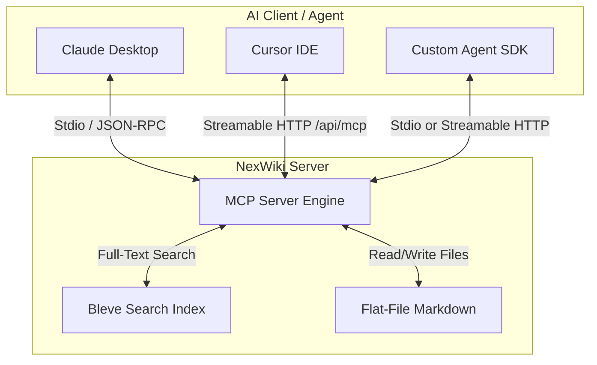

# AI Agents & Model Context Protocol (MCP) in NexWiki 🤖

NexWiki is designed as an **AI-ready second brain**. In addition to providing a beautiful personal knowledge base web application, NexWiki runs an **always-on Model Context Protocol (MCP) server**. 

This protocol acts as a standardized bridge allowing AI agents (like Claude Desktop, Cursor, Windsurf, or custom LLM systems) to query, read, and explore your personal wiki in real-time. By connecting your agent to NexWiki, you empower it to reason with access to your entire personal knowledge base.

---

## 📚 Project Documentation Guide

If you are a developer or an AI agent interacting with this repository, please observe the following documentation hierarchy:
* **Developer Setup & Quickstart**: Refer to the root [README.md](./README.md) for everything needed to get NexWiki up and running for local development, compilation, and building.
* **Technical & Content Guides**: Technical documentation, user manuals, and content guides are located in the [docs/](./docs) directory (e.g., the [docs/user_guide.md](./docs/user_guide.md)).
* **AI & MCP Agent Specifications**: This file ([AGENTS.md](./AGENTS.md)) is strictly reserved for documenting the Model Context Protocol details, exposed AI tools, and integration configurations.
* **Documentation Integrity Rule ⚠️**: When new features are created in NexWiki:
  1. The feature must be added to the feature list in the root [README.md](./README.md).
  2. A new, detailed user guide document must be created inside the [docs/](./docs) folder. All user guides must teach the user how to use the feature and provide useful, practical examples.
  3. A reference and link to this new document must be added directly into the [docs/README.md](./docs/README.md) hub page.

---

## 🏗️ Architecture Overview

NexWiki's MCP implementation is lightweight, robust, and supports two primary transport layers:

1. **Stdio (Standard Input/Output)**: Typically used for local server-agent processes. The agent runs the NexWiki binary or spins up the Docker container directly, piping JSON-RPC 2.0 messages via standard input/output.
2. **Streamable HTTP**: Enables a modern, secure networked connection over HTTP (2025 Spec, the official successor to the deprecated HTTP+SSE specification). It uses a streamable HTTP connection at `/api/mcp` supporting GET (initiating the stream) and POST (executing synchronous JSON-RPC commands) to execute tools.



### 🔒 Log Safety Guarantee
To prevent stdio pipe corruption (which breaks JSON-RPC communication in tools like Claude Desktop), **NexWiki redirects all internal system and web application logs exclusively to standard error (`Stderr`)**. Only valid JSON-RPC envelopes are ever output to `Stdout`.

### 🌐 Environment Variables Prefixing Rule
To prevent name collisions, improve system modularity, and establish unified system governance, **all custom environment variables supported or created for NexWiki must be prefixed exclusively with `NEXWIKI_`** (for example, `NEXWIKI_NAME` and `NEXWIKI_THEME`).

---

## 🛠️ Exposed MCP Tools

The NexWiki MCP server registers and exposes twenty powerful, semantic tools for AI agents:

### 1. `search_wiki`
Performs a high-speed, full-text search across all wiki articles using the built-in **Bleve Search** engine. It supports advanced queries (wildcards, exact phrase quotes, and logical operators).

* **Arguments**:
  * `query` (string, **required**): The search keywords or query string.
* **Output Format**:
  A structured, human-readable summary containing scored matches, slug identifiers, and content snippets. To optimize LLM context usage, all HTML `<mark>` search highlight tags are automatically converted to clean Markdown bold formatting (`**`).

* **Example Call (JSON-RPC)**:
  ```json
  {
    "jsonrpc": "2.0",
    "method": "tools/call",
    "params": {
      "name": "search_wiki",
      "arguments": {
        "query": "setup guide"
      }
    },
    "id": 1
  }
  ```

---

### 2. `read_article`
Retrieves the raw Markdown content and Yaml-style front-matter configurations of a specific article using its URL-safe slug.

* **Arguments**:
  * `slug` (string, **required**): The clean, URL-safe slug of the target article (e.g. `home` or `setup-guide`).
* **Output Format**:
  A plain text document listing the article Title, Slug, Created timestamp, Updated timestamp, and the complete raw Markdown content.

* **Example Call (JSON-RPC)**:
  ```json
  {
    "jsonrpc": "2.0",
    "method": "tools/call",
    "params": {
      "name": "read_article",
      "arguments": {
        "slug": "setup-guide"
      }
    },
    "id": 2
  }
  ```

---

### 3. `list_articles`
Lists all articles currently available in your knowledge base. This acts as a directory index for the agent to understand what documentation exists.

* **Arguments**: None (empty object `{}`).
* **Output Format**:
  A bulleted plain text index containing the titles, URL-safe slugs, and last-edited timestamps for all active articles.

* **Example Call (JSON-RPC)**:
  ```json
  {
    "jsonrpc": "2.0",
    "method": "tools/call",
    "params": {
      "name": "list_articles",
      "arguments": {}
    },
    "id": 3
  }
  ```

---

### 4. `create_wiki_article`
Creates a brand-new wiki article with a given title and raw Markdown content body. Automatically handles title slugification, checks for slug collision, and indexes the new article for search.

* **Arguments**:
  * `title` (string, **required**): The human-readable title of the new article (e.g. "React Hooks Guide").
  * `content` (string, **required**): The raw Markdown content of the article body.
  * `tags` (array of strings, **optional**): Status or user tags to apply to the article. Call `get_status_tags` to see recognized status values (e.g. `draft`, `wip`). System `aiagent-*` tags are reserved and will be ignored if provided.
  * `edit_summary` (string, **optional**): A summary describing the reason for creating the page.
* **Output Format**:
  A confirmation string detailing the title, generated URL slug, creation timestamp, and initial version number.

---

### 5. `edit_wiki_article`
Modifies the title, Markdown content, or edit a summary of an existing wiki article. Uses **optimistic locking** to prevent write collision conflicts.

* **Arguments**:
  * `slug` (string, **required**): The unique URL slug of the article to edit.
  * `title` (string, **required**): The updated title of the article.
  * `content` (string, **required**): The updated raw Markdown content of the article body.
  * `tags` (array of strings, **optional**): Tags to set on the article (replaces existing user tags; existing system `aiagent-*` tags are always preserved). Call `get_status_tags` to see recognized status values. Omit to leave existing tags unchanged.
  * `loaded_version` (integer, **required**): The current version number loaded by the AI agent.
  * `edit_summary` (string, **optional**): A summary detailing the modifications.
* **Output Format**:
  A success message containing the slug, new active version number, and last-edited timestamp.

---

### 6. `update_article_tags`
Directly updates the tags array of an existing wiki article. This is fast, token-efficient, and prevents modifying the page content body, ensuring security and performance.

* **Arguments**:
  * `slug` (string, **required**): The unique URL slug of the article to update tags for.
  * `tags` (array of strings, **required**): The complete array of user/status tags to apply to the article (replaces existing user tags; system `aiagent-*` tags are always preserved).
  * `loaded_version` (integer, **optional**): The active version number of the article loaded by the client (helps detect multi-session edit collisions).
  * `edit_summary` (string, **optional**): Optional summary explaining the tag updates.
* **Output Format**:
  A success message confirming the new version number and updated tags list.

---

### 7. `delete_wiki_article`
Permanently deletes an existing wiki article, all its revision backups, and its uploaded media files from disk.

* **Arguments**:
  * `slug` (string, **required**): The URL-safe slug of the article to delete.
* **Output Format**:
  A success confirmation.

---

### 8. `get_article_history`
Retrieves the full revision history log of a wiki page, showing version numbers, timestamps, and edit summaries.

* **Arguments**:
  * `slug` (string, **required**): The URL-safe slug of the target article.
* **Output Format**:
  A structured, bulleted plain text revision list.

---

### 9. `revert_article_version`
Reverts the active state of an article to a specific historical version number.

* **Arguments**:
  * `slug` (string, **required**): The URL slug of the target article.
  * `version` (integer, **required**): The historical version number to restore.
* **Output Format**:
  A success message confirming the new active version.

---

### 10. `get_wiki_statistics`
Scans the entire knowledge base to compile total page stats and **autonomously scan for dead or broken internal WikiLinks** (e.g., `[[Missing Page]]`).

* **Arguments**: None (empty object `{}`).
* **Output Format**:
  A summary text listing total articles, total WikiLinks scanned, total dead links, and details on exactly which pages contain broken links so the AI agent can autonomously fix them!

---

### 11. `create_agent_memory`
Creates a brand new protected AI Agent Memory document (such as a troubleshooting note, architecture decision, or custom rules).

* **Arguments**:
  * `title` (string, **required**): The human-readable title of the memory article (e.g. "Build Server Outage Resolution").
  * `content` (string, **required**): The raw Markdown content of the memory document body.
  * `memory_type` (string, **required**): The type of memory to log. Must be one of: `troubleshooting`, `memory`, `decision`, `todo`, `rules`.
  * `project_context` (string, **optional**): A context string (like a project ID) to generate a secondary custom tag (e.g. `"project-x"` tags the document with `"project-x"`).
  * `edit_summary` (string, **optional**): Optional description summarizing why this memory was created.
* **Output Format**:
  A structured, human-readable success message with slug, creation timestamp, version, and applied tags. All memory types automatically receive the protected tag `aiagent-memory-<type>`.

---

### 12. `append_agent_memory`
Appends observations, subtask completions, or updates to the end of an existing protected AI Agent Memory page (must be tagged with an `aiagent-memory-` prefix).

* **Arguments**:
  * `slug` (string, **required**): The unique URL-safe slug of the target memory article.
  * `content_to_append` (string, **required**): The raw Markdown text to append.
  * `edit_summary` (string, **optional**): Optional summary outlining what was appended.
* **Output Format**:
  A success message with the new version and update timestamp.

---

### 13. `list_agent_memories`
Lists all protected AI Agent Memory articles (tagged with `aiagent-memory-` prefix) saved in your wiki.

* **Arguments**:
  * `memory_type` (string, **optional**): An optional memory type to filter the listing (e.g., `troubleshooting`, `memory`, `decision`, `todo`, `rules`).
* **Output Format**:
  A bulleted plain text index containing the titles, URL-safe slugs, active tags, and edit summaries of matching memory documents.

---

### 14. `create_agent_plan`
Creates a new Collaborative AI Plan that can be collaboratively edited/viewed by both the user and the agent.

* **Arguments**:
  * `title` (string, **required**): The human-readable title of the plan (e.g., "Go 1.22 Migration Plan").
  * `content` (string, **required**): The raw Markdown content of the plan document.
  * `project_context` (string, **required**): The name of the project this plan is for (e.g. "nexwiki"). Generates a custom project tag.
  * `edit_summary` (string, **optional**): Optional summary detailing the creation of the plan.
* **Output Format**:
  A success message containing the title, slug, version, creation timestamp, and all applied tags (including the auto-applied `aiagent-plan` tag).

---

### 15. `append_agent_plan`
Appends task status, observations, or checklists to an existing Collaborative AI Plan (must possess the `aiagent-plan` tag).

* **Arguments**:
  * `slug` (string, **required**): The unique URL-safe slug of the target plan.
  * `content_to_append` (string, **required**): The raw Markdown text to append to the end of the plan.
  * `edit_summary` (string, **optional**): Optional summary outlining the updates.
* **Output Format**:
  A success message confirming the new plan version and update timestamp.

---

### 16. `edit_agent_plan`
Modifies the title, tags, or edit the summary of an existing Collaborative AI Plan. Uses optimistic locking to prevent concurrent edit conflicts and automatically preserves/prepends the protected `aiagent-plan` tag.

* **Arguments**:
  * `slug` (string, **required**): The unique URL slug of the plan to edit.
  * `title` (string, **optional**): The updated title of the plan (preserves existing title if omitted).
  * `tags` (array of strings, **optional**): Array of tags to set (replaces existing tags; 'aiagent-plan' is always auto-applied and preserved).
  * `loaded_version` (integer, **required**): The current version number loaded by the AI agent for optimistic locking checks.
  * `edit_summary` (string, **optional**): Description summarizing what changed.
* **Output Format**:
  A success message confirming the new plan version, last-edited timestamp, and applied tags list.

---

### 17. `list_agent_plans`
Lists all Collaborative AI Plans (tagged with `aiagent-plan`) currently saved inside the knowledge base.

* **Arguments**:
  * `project_context` (string, **optional**): An optional project context name to filter plans by.
  * `tag` (string, **optional**): An optional tag name to filter plans by (e.g., `completed`). Only plans with this tag will be returned.
* **Output Format**:
  A bulleted index of all collaborative plans with titles, slugs, and active tags.

---

### 18. `create_agent_skill`
Creates a new Custom AI Skill, automatically making it part of the custom Skills Registry.

* **Arguments**:
  * `title` (string, **required**): The title of the skill (e.g., "Docker Container Pruning").
  * `content` (string, **required**): The raw Markdown content of the skill instructions (procedural SKILL.md format).
  * `tags` (array of strings, **optional**): Optional user tags to apply to the skill.
  * `edit_summary` (string, **optional**): Optional summary describing why the skill was created.
* **Output Format**:
  A success message containing the title, slug, version, creation timestamp, and all applied tags (including the auto-applied `aiagent-skill` tag).

---

### 19. `list_agent_skills`
Lists all Custom AI Skills (tagged with `aiagent-skill`) currently saved in the knowledge base.

* **Arguments**: None (empty object `{}`).
* **Output Format**:
  A bulleted plain text index containing the titles, slugs, and tags of all registered skills.

---

### 20. `get_status_tags`
Returns the canonical list of recognized status tags used to indicate the lifecycle state of wiki articles and AI plans.

* **Arguments**: None (empty object `{}`).
* **Output Format**:
  A plain text listing of all recognized status tag values and a tip on how to use them with `list_agent_plans`. Status tags are displayed with highest visual priority on the home dashboard. Call this before tagging articles, plans, or skills to ensure you use a recognized value.

* **Recognized values**: `completed`, `done`, `wip`, `draft`, `in-progress`, `archived`, `active`, `todo`, `pending`, `review`, `blocked`, `ready`

---

## 🎯 MCP Prompts

In addition to tools, NexWiki exposes two **MCP Prompts** — interactive workflow templates that guide an AI agent through a multi-step task. Clients that support the `prompts/list` and `prompts/get` MCP methods (such as Claude Desktop) can invoke these by name.

### 1. `article_creation_workflow`
Guides the agent to search for existing formatting/style guidelines and custom memories *before* writing a new wiki article, ensuring consistency across the knowledge base.

* **Arguments**:
  * `title` (string, **required**): The title of the article to be created.
  * `description` (string, **optional**): A brief summary of what the article should cover.
* **Behavior**:
  Instructs the agent to call `list_agent_memories` / `search_wiki` to locate relevant style-guide memories, read them with `read_article`, incorporate the rules into the new article, and then save it with `create_wiki_article`.

---

### 2. `project_planning_workflow`
Guides the agent to collaboratively outline a new development plan with the user and immediately persist it as a Collaborative AI Plan in NexWiki.

* **Arguments**:
  * `title` (string, **required**): The title of the Collaborative Plan (e.g. "Go 1.22 Migration Plan").
  * `project` (string, **required**): The project context name (e.g. `nexwiki`).
* **Behavior**:
  Instructs the agent to collaboratively outline objectives, technical requirements, and task checklists with the user, save the initial plan immediately with `create_agent_plan`, report the slug to the user, and use `append_agent_plan` to log progress as tasks are completed.

---

## 🔌 Connecting Popular AI Clients

### 1. Claude Desktop (Stdio Connection)
You can configure your local Claude Desktop app to talk directly to your NexWiki instance. Locate your Claude Desktop configuration file:
* **macOS**: `~/Library/Application Support/Claude/claude_desktop_config.json`
* **Windows**: `%APPDATA%\Claude\claude_desktop_config.json`

Add the `nexwiki` server block inside the `mcpServers` object:

#### Option A: Connection via Running Docker Container (Recommended)
If you run NexWiki via Docker with the container name `personal-wiki`:
```json
{
  "mcpServers": {
    "nexwiki": {
      "command": "docker",
      "args": ["exec", "-i", "personal-wiki", "/app/nexwiki"]
    }
  }
}
```

#### Option B: Connection via Local Go Binary
If you compiled the binary on your local machine:
```json
{
  "mcpServers": {
    "nexwiki": {
      "command": "/path/to/your/compiled/nexwiki",
      "args": [
        "-data", "/path/to/your/wiki-data",
        "-name", "My Personal Brain"
      ]
    }
  }
}
```

Restart Claude Desktop, and you will see the **hammer icon 🔨** in the chat window, confirming that all twenty NexWiki MCP tools are ready to use!

---

### 2. Cursor IDE (Streamable HTTP Connection – Preferred)
NexWiki implements the modern **Streamable HTTP** transport (2025 Spec) at `/api/mcp`.

1. Open **Cursor Settings** (Gear icon in top right).
2. Go to **Features** → **MCP**.
3. Click **+ Add New MCP Server**.
4. Configure the server with the following settings:
   * **Name**: `nexwiki`
   * **Type**: `Streamable HTTP` *(Note: select `SSE` as a fallback if your Cursor version does not list the new 2025 Streamable HTTP type yet)*
   * **URL**: `http://localhost:8080/api/mcp` (or your production domain e.g. `https://wiki.yourdomain.com/api/mcp`)
5. Click **Save**.

Cursor will establish a stream connection and immediately list all twenty NexWiki tools in the sidebar. You can now use Cursor Composer or chat (`Cmd+K` / `Ctrl+K`) and reference your wiki directly during code generation!

---

## 💡 Developer Guidelines: Custom Clients

If you are building your own AI agent workflows (using Python, Node.js/TypeScript, or Go), you can interface with NexWiki using standard MCP SDKs.

### Example in Python (using `mcp` SDK)
```python
import asyncio
from mcp import ClientSession, StdioServerParameters
from mcp.client.stdio import stdio_client

# Define the server parameters
server_params = StdioServerParameters(
    command="docker",
    args=["exec", "-i", "personal-wiki", "/app/nexwiki"]
)

async def query_wiki():
    async with stdio_client(server_params) as (read_stream, write_stream):
        async with ClientSession(read_stream, write_stream) as session:
            # Initialize connection
            await session.initialize()
            
            # List available tools
            tools = await session.list_tools()
            print("Exposed Tools:", [t.name for t in tools.tools])
            
            # Execute a full-text search
            result = await session.call_tool("search_wiki", arguments={"query": "Docker"})
            print("\nSearch Results:\n", result.content[0].text)

asyncio.run(query_wiki())
```

### Direct HTTP Request (Minimal JSON-RPC POST)
If you don't want to use an MCP SDK and prefer standard HTTP requests, you can interact with the server's Streamable HTTP endpoint. For execution, issue standard HTTP `POST` requests to `/api/mcp`:

```bash
curl -X POST http://localhost:8080/api/mcp \
  -H "Content-Type: application/json" \
  -d '{
    "jsonrpc": "2.0",
    "method": "tools/call",
    "params": {
      "name": "list_articles",
      "arguments": {}
    },
    "id": 1
  }'
```

---

## 🧠 Design Tips for AI Agents Interacting with NexWiki

If you are prompting or building an agent to work with NexWiki, teach it these best practices:
1. **Explore First**: Start by running `list_articles` to see an index of what is available, or use `search_wiki` to query specific keywords.
2. **Resolve Slugs Intelligently**: When linking or reading, always use the URL-safe slug (e.g. `setup-guide`) rather than the raw article title.
3. **Handle WikiLinks**: NexWiki files contain internal `[[Double Bracket]]` links. When displaying these to users, agents should resolve them to clean relative links `/articles/target-slug` or explain them as references.
4. **Context Management**: Raw Markdown files can occasionally grow large. Prefer searching first to locate key headings/sections before reading the entire article if context window limits are a concern.
