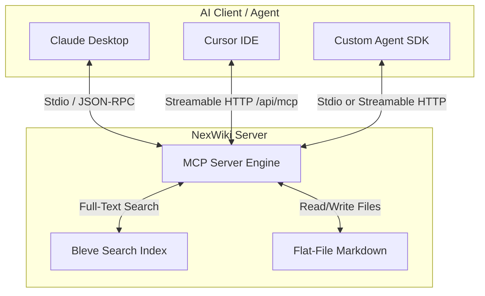

# AI Agents & Model Context Protocol (MCP) in NexWiki 🤖

NexWiki is designed as an **AI-ready second brain**. In addition to providing a beautiful personal knowledge base web application, NexWiki runs an **always-on Model Context Protocol (MCP) server**. 

This protocol acts as a standardized bridge allowing AI agents (like Claude Desktop, Cursor, Windsurf, or custom LLM systems) to query, read, and explore your personal wiki in real-time. By connecting your agent to NexWiki, you empower it to reason with access to your entire personal knowledge base.

---

## 📚 Project Documentation Guide

If you are a developer or an AI agent interacting with this repository, please observe the following documentation hierarchy:
* **Developer Setup & Quickstart**: Refer to the root [README.md](./README.md) for everything needed to get NexWiki up and running for local development, compilation, and building.
* **Technical & Content Guides**: Technical documentation, user manuals, and content guides are located in the [docs/](./docs) directory (e.g., the [docs/user_guide.md](./docs/user_guide.md)).
* **MCP Tool Reference**: [docs/mcp_server.md](./docs/mcp_server.md) is the **single canonical reference** for every exposed MCP tool. This file (AGENTS.md) covers MCP architecture, prompts, client configuration, and agent design guidance — it deliberately does **not** duplicate the tool reference.
* **Documentation Integrity Rule ⚠️**: When new features are created in NexWiki:
  1. The feature must be added to the feature list in the root [README.md](./README.md).
  2. A new, detailed user guide document must be created inside the [docs/](./docs) folder. All user guides must teach the user how to use the feature and provide useful, practical examples.
  3. A reference and link to this new document must be added directly into the [docs/README.md](./docs/README.md) hub page.
  4. **If the feature adds or removes an MCP tool**: document it in [docs/mcp_server.md](./docs/mcp_server.md) (the canonical reference) and update the tool count in **every** place it is stated — currently [README.md](./README.md), [docs/README.md](./docs/README.md), [docs/second_brain_workflow_guide.md](./docs/second_brain_workflow_guide.md), and this file. Never restate the full tool list outside `docs/mcp_server.md`.

---

## 🏗️ Architecture Overview

NexWiki's MCP implementation is lightweight, robust, and supports two primary transport layers:

1. **Stdio (Standard Input/Output)**: Typically used for local server-agent processes. The agent runs the NexWiki binary or spins up the Docker container directly, piping JSON-RPC 2.0 messages via standard input/output.
2. **Streamable HTTP**: A modern, networked connection over HTTP at `/api/mcp`, the official successor to the deprecated HTTP+SSE transport. POST carries every JSON-RPC message.

### 🕰️ Dual-Era Protocol Support
The MCP specification changed shape in revision **`2026-07-28`**: no `initialize` handshake, no sessions, protocol version and client capabilities carried in `_meta` on every request, and results wrapped with a `resultType`. NexWiki serves **both that revision and the older initialize-based revisions on the same endpoint**, choosing per request — a request whose `params._meta` carries `io.modelcontextprotocol/protocolVersion` is modern, anything else is legacy. Both eras share the same tools and prompts.

Modern-era specifics (required `_meta` fields, the `MCP-Protocol-Version` / `Mcp-Method` / `Mcp-Name` header contract, `server/discover`, the mandatory `ttlMs` / `cacheScope` caching hints, and the `-32020` / `-32022` error codes) are documented in [docs/mcp_server.md](./docs/mcp_server.md#-protocol-revisions-nexwiki-is-dual-era).

**Capabilities are declared per era**, because the same word promises a different method in each: `resources.subscribe` means `subscriptions/listen` in the modern revision and the `resources/subscribe` RPC in the older ones, so only modern clients are told about it. Both eras serve cursor **pagination** on the four list methods and **`completion/complete`** for prompt arguments and article slugs; `ping` answers only in the legacy era, having been removed by the 2026-07-28 revision.


```mermaid
graph TD
    subgraph AI Client / Agent
        Claude[Claude Desktop]
        Cursor[Cursor IDE]
        Custom[Custom Agent SDK]
    end

    subgraph NexWiki Server
        MCPEngine[MCP Server Engine]
        Bleve[Bleve Search Index]
        FlatFiles[Flat-File Markdown]
    end

    Claude <-->|Stdio / JSON-RPC| MCPEngine
    Cursor <-->|Streamable HTTP /api/mcp| MCPEngine
    Custom <-->|Stdio or Streamable HTTP| MCPEngine

    MCPEngine <-->|Full-Text Search| Bleve
    MCPEngine <-->|Read/Write Files| FlatFiles
```

### 🔒 Log Safety Guarantee
To prevent stdio pipe corruption (which breaks JSON-RPC communication in tools like Claude Desktop), **NexWiki redirects all internal system and web application logs exclusively to standard error (`Stderr`)**. Only valid JSON-RPC envelopes are ever output to `Stdout`.

### 🌐 Environment Variables Prefixing Rule
To prevent name collisions, improve system modularity, and establish unified system governance, **all custom environment variables supported or created for NexWiki must be prefixed exclusively with `NEXWIKI_`** (for example, `NEXWIKI_NAME` and `NEXWIKI_THEME`).

### 🔀 Process Model: Bind-or-Halt vs. `-mcp-only`
A **normal launch is the web server**: it binds the configured port or halts (it never silently falls back). It also owns the durable activity log.

To run a **stdio MCP server next to an already-running web primary** — which is exactly what a Claude Desktop subprocess does — start NexWiki with the **`-mcp-only`** flag (or `NEXWIKI_MCP_ONLY=true`). That skips the port bind entirely. If it detects a running NexWiki web server on its `-port`, it proxies all MCP traffic to it and never opens the data directory; with no web server, it opens the data directory itself, serves all tools from the in-process storage layer, and persists the activity log directly.

> ⚠️ **Every stdio client config below must pass `-mcp-only`.** Without it, the spawned process starts as a second web server and exits. Pointed at your running instance's data directory, it waits 15 seconds for the search index lock and exits with `Fatal: could not open the search index`; pointed at a different data directory, it exits with `Fatal: could not bind web server`.

> **A sidecar beside a running web server now proxies to it.** Only one process can own the data directory (the search index holds an exclusive lock), so the sidecar forwards MCP traffic to the primary instead of opening storage — and relays the primary's subscription stream, which is how its client gets live notifications when it has no `EventBus` of its own. A standalone stdio server serves subscriptions directly.

---

## 🛠️ Exposed MCP Tools

The NexWiki MCP server registers and exposes **nine** semantic tools for AI agents, covering search, structured reads, unified document writes with optimistic locking, append, listing with pagination, deletion, progressive-disclosure wiki overview, backlink traversal, and wiki health auditing.

NexWiki also exposes **Resources** (`nexwiki://article/{slug}`) so a user can `@`-mention a wiki page directly, and **`subscriptions/listen`** so an agent is notified the moment a document is edited or the document set changes — on **both** Streamable HTTP and stdio. `completion/complete` autocompletes the `{slug}`, so a client discovers a page to mention instead of paging the whole resource list. See [docs/mcp_server.md](./docs/mcp_server.md#-resources---mention-a-wiki-page).

Every tool carries MCP **annotations** (`readOnlyHint`, `destructiveHint`, `idempotentHint`, `openWorldHint`, `title`) so clients can auto-approve safe reads and confirm destructive writes. `openWorldHint` is `false` on all 9 — the entire surface is local. See [docs/mcp_server.md](./docs/mcp_server.md#-tool-annotations--fewer-approval-prompts).

Six read tools additionally declare an **`outputSchema`** and return `structuredContent` alongside their prose, so an agent parses data instead of scraping sentences — `read_article` hands back `version` as a number to pass straight to `save_article` or `append_article` as `loaded_version`. The text is always still emitted, and both halves are rendered from the same value so they cannot disagree (`read_article` ships its Markdown body in both `content[0].text` and `structuredContent.article.content`, ensuring full interoperability across text-only and structured MCP clients). See [docs/mcp_server.md](./docs/mcp_server.md#-structured-output--parse-data-dont-scrape-prose).

📖 **The complete reference — every tool, argument, and behavior — lives in [docs/mcp_server.md](./docs/mcp_server.md).** It is kept in lockstep with `server/mcp.go`; this file intentionally does not duplicate it.

Agents can also enumerate tools at runtime with the standard `tools/list` MCP method:

```bash
curl -X POST http://localhost:5808/api/mcp \
  -H "Content-Type: application/json" \
  -d '{"jsonrpc":"2.0","method":"tools/list","params":{},"id":1}'
```

### Document types and system tags
Every NexWiki `.md` file is a conformant **Open Knowledge Format (OKF v0.2)** concept document at rest (real YAML front matter). Each carries a `type` — exactly one of **`Wiki`** or the reserved **`AI-Agent-Memory`** / **`AI-Agent-Plan`** / **`AI-Agent-Skill`** classes, set by `save_article`'s `type` argument. An update that omits `type` keeps the current one; an explicit `type` relabels the document (see [docs/mcp_server.md](./docs/mcp_server.md#changing-a-documents-type)). The legacy `aiagent-*` *class* tags are gone; the class is now the `type`. System tags that remain: **status tags** (e.g. `draft`, `implementing`, `completed`) and tool-managed **memory-scope tags** (`memory-<scope>`).

---

## 🎯 MCP Prompts

In addition to tools, NexWiki exposes two **MCP Prompts** — interactive workflow templates that guide an AI agent through a multistep task. Clients that support the `prompts/list` and `prompts/get` MCP methods (such as Claude Desktop) can invoke these by name.

### 1. `article_creation_workflow`
Guides the agent to search for existing formatting/style guidelines and custom memories *before* writing a new wiki article, ensuring consistency across the knowledge base.

* **Arguments**:
  * `title` (string, **required**): The title of the article to be created.
  * `description` (string, **optional**): A brief summary of what the article should cover.
* **Behavior**:
  Instructs the agent to call `list_articles` (with `type: "memories"`) or `search_wiki` to locate relevant style-guide memories, read them with `read_article`, incorporate the rules into the new article, and then save it with `save_article`.

---

### 2. `project_planning_workflow`
Guides the agent to collaboratively outline a new development plan with the user and immediately persist it as a Collaborative AI Plan in NexWiki.

* **Arguments**:
  * `title` (string, **required**): The title of the Collaborative Plan (e.g. "Go 1.22 Migration Plan").
  * `project` (string, **required**): The project context name (e.g. `nexwiki`).
* **Behavior**:
  Instructs the agent to collaboratively outline goals, technical requirements, and task checklists with the user, save the initial plan immediately with `save_article` (specifying `type: "AI-Agent-Plan"` and `project_context`), report the slug to the user, and use `append_article` to log progress as tasks are completed. After full implementation, the agent must append final notes and mark the plan as `completed` using `save_article` with `status: "completed"`. The reserved `AI-Agent-Plan` OKF type must never be relabelled.

---

## 🔌 Connecting Popular AI Clients

> **Prefer Streamable HTTP.** It reuses the single running server process and avoids spawning extra binaries. Stdio (`-mcp-only`) also works: with the web server running, each stdio process proxies to it; without one, the process opens the data directory itself, and a web server started on that directory meanwhile fails with a lock error. See [docs/mcp_server.md](./docs/mcp_server.md#-connecting-clients).

### 1. Claude Desktop

Locate your Claude Desktop configuration file:
* **macOS**: `~/Library/Application Support/Claude/claude_desktop_config.json`
* **Windows**: `%APPDATA%\Claude\claude_desktop_config.json`

Add the `nexwiki` server block inside the `mcpServers` object:

#### Option A: Streamable HTTP (Recommended)
```json
{
  "mcpServers": {
    "nexwiki": {
      "url": "http://localhost:5808/api/mcp"
    }
  }
}
```

#### Option B: Stdio via Running Docker Container
If you run NexWiki via Docker with the container name `personal-wiki`:
```json
{
  "mcpServers": {
    "nexwiki": {
      "command": "docker",
      "args": ["exec", "-i", "personal-wiki", "/app/nexwiki", "-mcp-only", "-data", "/app/data"]
    }
  }
}
```
`docker exec` bypasses the image ENTRYPOINT, so `-mcp-only` and `-data` must be passed explicitly. Without `-mcp-only`, the process starts as a second web server and exits. Pointed at the container's `/app/data`, it waits 15 seconds for the search index lock and exits with `Fatal: could not open the search index`; pointed at a different data directory (e.g., with `-data` omitted), it exits with `Fatal: could not bind web server` on the `:5808` default.

#### Option C: Stdio via Local Go Binary
If you compiled the binary on your local machine:
```json
{
  "mcpServers": {
    "nexwiki": {
      "command": "/path/to/your/compiled/nexwiki",
      "args": [
        "-mcp-only",
        "-data", "/path/to/your/wiki-data",
        "-name", "My Personal Brain"
      ]
    }
  }
}
```

Restart Claude Desktop, and you will see the **hammer icon 🔨** in the chat window, confirming that all nine NexWiki MCP tools are ready to use!

---

### 2. Cursor IDE (Streamable HTTP Connection – Preferred)
NexWiki implements the modern **Streamable HTTP** transport at `/api/mcp`, serving both the `2026-07-28` revision and the older initialize-based revisions.

1. Open **Cursor Settings** (Gear icon in top right).
2. Go to **Features** → **MCP**.
3. Click **+ Add New MCP Server**.
4. Configure the server with the following settings:
   * **Name**: `nexwiki`
   * **Type**: `Streamable HTTP` *(Note: select `SSE` as a fallback if your Cursor version does not list the new 2025 Streamable HTTP type yet)*
   * **URL**: `http://localhost:5808/api/mcp` (or your production domain e.g. `https://wiki.yourdomain.com/api/mcp`)
5. Click **Save**.

Cursor will establish a stream connection and immediately list all nine NexWiki tools in the sidebar. You can now use Cursor Composer or chat (`Cmd+K` / `Ctrl+K`) and reference your wiki directly during code generation!

> Per-client setup for **Claude Code**, **GitHub Copilot CLI**, and other agent CLIs is documented in [docs/mcp_server.md](./docs/mcp_server.md#-connecting-clients).

---

## 💡 Developer Guidelines: Custom Clients

If you are building your own AI agent workflows (using Python, Node.js/TypeScript, or Go), you can interface with NexWiki using standard MCP SDKs.

### Example in Python (using `mcp` SDK)
```python
import asyncio
from mcp import ClientSession, StdioServerParameters
from mcp.client.stdio import stdio_client

# Define the server parameters.
# -mcp-only is required: it detects the container's running web server and
# proxies MCP traffic to it. Without it, this subprocess starts as a second web
# server, waits 15 seconds for the search index lock on /app/data, and exits.
server_params = StdioServerParameters(
    command="docker",
    args=["exec", "-i", "personal-wiki", "/app/nexwiki", "-mcp-only", "-data", "/app/data"]
)

async def query_wiki():
    async with stdio_client(server_params) as (read_stream, write_stream):
        async with ClientSession(read_stream, write_stream) as session:
            # Initialize connection
            await session.initialize()
            
            # List available tools
            tools = await session.list_tools()
            print("Exposed Tools:", [t.name for t in tools.tools])
            
            # Execute a full-text search
            result = await session.call_tool("search_wiki", arguments={"query": "Docker"})
            print("\nSearch Results:\n", result.content[0].text)

asyncio.run(query_wiki())
```

### Direct HTTP Request (Minimal JSON-RPC POST)
If you don't want to use an MCP SDK and prefer standard HTTP requests, you can interact with the server's Streamable HTTP endpoint. For execution, issue standard HTTP `POST` requests to `/api/mcp`:

```bash
curl -X POST http://localhost:5808/api/mcp \
  -H "Content-Type: application/json" \
  -d '{
    "jsonrpc": "2.0",
    "method": "tools/call",
    "params": {
      "name": "list_articles",
      "arguments": {}
    },
    "id": 1
  }'
```

---

## 🧠 Design Tips for AI Agents Interacting with NexWiki

If you are prompting or building an agent to work with NexWiki, teach it these best practices:
1. **Orient First (Progressive Disclosure)**: Start a session with `get_wiki_overview` — a bounded orientation (document counts, the `user` and `feedback` memories, the plans in flight, and the recent activity) whose size does not grow with the wiki. It does not list every document: use `list_articles` (filter by `type`, `status`, or `tag`) for the full index and `search_wiki` for a topic. Then `read_article` only the entries you actually need. Pass `since` (e.g. `get_wiki_overview(since: "48h")`, the default) to set how far back the activity catch-up reaches.
2. **Resolve Slugs Intelligently**: When linking or reading, always use the URL-safe slug (e.g. `setup-guide`) rather than the raw article title.
3. **Handle Internal Links**: NexWiki files link internally in two equivalent forms — `[[Double Bracket]]` WikiLinks and absolute `[text](/articles/target-slug)` Markdown links. Both are counted by the link graph, both are healed on rename, and both are checked by `wiki_health`. When displaying a WikiLink to users, resolve it to `/articles/target-slug` or explain it as a reference. Use `get_backlinks` to traverse the graph in reverse before editing or deleting a page.
4. **Context Management**: Raw Markdown files can occasionally grow large. Prefer `get_wiki_overview` or `search_wiki` to locate key articles/sections before reading an entire article if context window limits are a concern.
5. **Respect Reserved Types**: Omit `type` when editing a reserved `AI-Agent-*` document — an explicit `type` on a `save_article` update relabels it — and never strip a tool-managed `memory-<scope>` tag. Lifecycle state goes in `status`, not tags; `get_wiki_overview`'s `status_tags` output lists the valid plan and skill values.
6. **Follow the Pinned Memories**: `get_wiki_overview` returns the operator's `user` and `feedback` memories as `pinned_memories`. They are the operator's standing preferences and corrections — follow them over generic defaults. There is no separate rules page to load.
