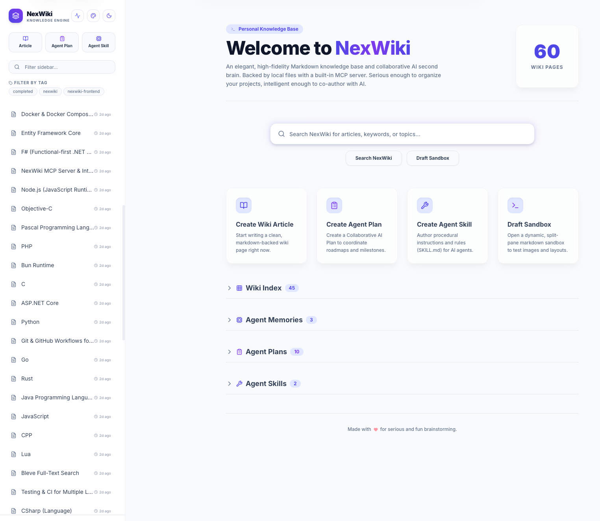

# NexWiki 🚀

NexWiki is an elegant, lightning-fast personal and collaborative knowledge base written in **Go** with a modern embedded **React + TypeScript** frontend. It serves as a zero-dependency, self-contained wiki server that preserves your content as standard, human-readable Markdown files.

Designed as an **AI-ready second brain**, NexWiki bridges the gap between human notes and artificial intelligence. Beyond serving as a traditional wiki, it runs an always-on Model Context Protocol (MCP) server supporting standard Stdio and the modern Streamable HTTP transport (2025 Spec). This lets AI agents (like Claude, Cursor, and custom tools) instantly query, read, and explore your knowledge base using twenty built-in semantic tools. With first-class workflows for secure AI memories, collaborative plans, and a dynamic custom AI skills registry, NexWiki transforms your personal wiki into an active, collaborative environment where AI assistants can reason, learn, and work directly with you.



---

## ✨ Features

- **📦 Zero-Dependency Single Binary**: Frontend-compiled assets are embedded directly inside the Go web server executable using Go's `go:embed`. No external asset servers are required.
- **⚡ Modern Responsive UI**: A sleek, high-fidelity Single Page Application (SPA) built using React 19, TypeScript, Vite, Lucide Icons, and styled with Tailwind CSS (v3).
- 🏷️ **Dynamic Tagging & Navigation**: Organize note files using custom tags. Filter documents instantly using the interactive sidebar Tag Cloud, add/remove tags in the split-editor, and perform global tag deletion with one click.
- 🤖 **Isolated & Protected AI Memories**: Dedicated, secure support for AI-created memories (plans, troubleshooting guides, decisions, todos, rules) protected by `aiagent-memory-` and `aiagent-` prefixed tags, with page slugs named after features and project contexts attached as custom tags. These pages are isolated and auto-excluded from default searches by default. While standard users cannot manually create or add *new* protected tags, they have full freedom to edit and delete the documents themselves and remove existing tags as they see fit.
- 🛠️ **AI Agent Skills & Custom Registry**: Create, edit, delete, and manage custom AI Agent skills (procedural instructions) inside the wiki. Skills are auto-tagged with `aiagent-skill` and isolated inside a dedicated **Collapsible Sidebar Folder** to keep your wiki clean. It registers dedicated REST API routes (`GET /api/skills`, `GET /api/skills/{slug}`, and `GET /api/skills/{slug}/raw`) allowing third-party tools (like JetBrains AI Assistant, custom agents, or Claude Code) to easily consume the wiki as a custom, dynamic Skills Registry.
- **🤖 Built-in MCP Server & Agent Governance**: Exposes twenty powerful Model Context Protocol tools (including dedicated, cleanly separated tools for managing AI memories, collaborative AI plans, and custom AI skills) to AI clients via Stdio and Streamable HTTP. Includes native support for **MCP Prompts Protocol** (interactive task workflows), strict tool schema rules that force external coding agents to search memories and auto-save plans, and a new programmatic tool to edit collaborative plan metadata (`edit_agent_plan`).
- **🔍 Blazing-Fast Full-Text Search**: Powered by the robust `github.com/blevesearch/bleve/v2` engine. Supports advanced query parsing, scoring, and text snippet highlighting.
- **📂 Flat-File Markdown Storage**: Wiki pages are stored on disk as plain Markdown files with YAML-like front matter metadata. Your files remain completely portable and easily readable by external editors.
- 🕒 **Gzipped Flat-File Versioning**: Built-in revision engine that saves highly efficient compressed `.md.gz` gzip snapshots of your article history. Review historical changes side-by-side using interactive **Split Pane** or **Unified Inline** diff modes, roll back changes instantly, and prevent session write conflicts with automatic optimistic locking guards.
- 📤 **Export, Share, Copy & Bulk Archive Utilities**: Export any wiki article directly to a professional print-styled PDF (via a native vector-drawn printing engine, with cascade precedence CSS fixes), Microsoft Word (`.docx`), or standard Markdown (`.md`) files. Instantly copy raw body text or page URLs from a consolidated glassmorphic dropdown, and package your entire wiki database as a folder-categorized `.zip` archive (containing standard `wiki/` notes, `aimemories/`, `aiplans/`, `aiskills/`, and a root `README.md` index file) in one click.
- 🖼️ **Asset & Image Uploads**: Built-in support for uploading and referencing media assets (such as PNG, JPEG, GIF, SVG, and WebP) directly within articles.
- **⚙️ Dynamic Customization**: Personalize your wiki's name via environment variables (`NEXWIKI_NAME`) or command-line flags.
- 🎨 **Seasonal Theme Scheduling & Customizable Palettes**: Configure default themes via CLI flags or environment variables, customize dual-variant (Light/Dark) palettes using custom pickers, and schedule annual seasonal themes (`independence-day`, `halloween`, `christmas`, `new-years`) using CLI flags (`-theme-scheduling`) or environment parameters (`NEXWIKI_THEME_SCHEDULING`). Features scheduled badges and a deterministic overlap date hash resolver.
- 💻 **IDE-Grade CodeMirror 6 Editor & Cheat Sheet**: Replaced the primitive textarea with CodeMirror 6, complete with auto-resizing, Tab-indent formatting, image drag-and-drop, and clean transactional toolbar formats. Pressing `Ctrl+/` / `Cmd+/` instantly overlays a glassmorphic Markdown Syntax cheat cheatsheet. Integrates dynamic colors wrapping active themes (Option B) natively at runtime.
- 🔍 **Real-Time Markdown Linter & Inline Warnings**: Debounced validation checks your writing against standard rules (MD001 hierarchy, MD025 multiple H1s, MD037 interior spacing, MD034 bare URLs) and broken internal `[[WikiLinks]]`. Shows severity wavy underlines, hover details/quick fixes, right-click custom context menus, and a rich Diagnostics Dashboard modal with sorting, filters, cursor jumps, and AI Correction prompt copy tools.
- 📡 **Real-Time SSE Syncing & Live Activity Log**: Establish single global `EventSource` connections over `/api/activity/stream` backed by a thread-safe circular `EventBus` (caching the last 200 operations). Rapid AI tool mutations are buffered in a 500 ms cooldown window to show cumulative glowing badges (Option B), and live operations (REST API vs. MCP AI tools) stream to a slide-in Activity Drawer. Drives instant zero-refresh dashboard stats and active reader content synchronization.
- **🔒 Development Safety**: System logs are directed exclusively to standard error (`Stderr`) to prevent stdout corruption, guaranteeing stable MCP JSON-RPC Stdio piping.

---

## ⬇️ Quickstart: Download & Run a Pre-Built Binary

The easiest way to run NexWiki — no Docker, no Go toolchain required. Download the binary for your platform, make it executable, and run it.

### 1. Download the Binary

Visit the [GitHub Releases page](https://github.com/gruberchris/nexwiki/releases) and download the binary for your platform:

| Platform | Binary filename |
|---|---|
| macOS (Apple Silicon / M-series) | `nexwiki-{VERSION}-darwin-arm64` |
| Linux x86_64 | `nexwiki-{VERSION}-linux-amd64` |
| Linux ARM64 | `nexwiki-{VERSION}-linux-arm64` |
| Windows x86_64 | `nexwiki-{VERSION}-windows-amd64.exe` |

Each release also includes a `SHA256SUMS.txt` file you can use to verify your download:
```bash
# macOS / Linux
sha256sum -c SHA256SUMS.txt --ignore-missing
```

### 2. Make It Executable (macOS & Linux)

```bash
chmod +x nexwiki-*-darwin-arm64   # macOS
# or
chmod +x nexwiki-*-linux-amd64    # Linux x86_64
```

> **macOS note:** If macOS blocks the binary with a Gatekeeper warning, right-click the file in Finder → **Open** → **Open** to grant a one-time exception, or run: `xattr -d com.apple.quarantine ./nexwiki-*-darwin-arm64`

> **Windows note:** Windows Defender SmartScreen may show a warning for unsigned binaries. Click **More info** → **Run anyway** to proceed.

### 3. Run with Default Settings

```bash
# macOS / Linux
./nexwiki-1.0.0-darwin-arm64

# Windows (PowerShell)
.\nexwiki-1.0.0-windows-amd64.exe
```

Open your browser to `http://localhost:8080`. NexWiki will create a `./data` directory in the current folder to store your articles and search index.

### 4. Configuration

All settings can be set via CLI flags. The `NEXWIKI_NAME`, `NEXWIKI_THEME`, and `NEXWIKI_THEME_SCHEDULING` environment variables take precedence over their corresponding flags when both are set.

| Option | CLI Flag | Env Variable | Default | Description |
|---|---|---|---|---|
| HTTP port | `-port` | — | `8080` | Port the web server listens on |
| Data directory | `-data` | — | `./data` | Directory for articles, assets, and the search index |
| Wiki name | `-name` | `NEXWIKI_NAME` | `NexWiki` | Title displayed in the UI and HTML headers |
| Default theme | `-theme` | `NEXWIKI_THEME` | `default` | Initial active color theme |
| Seasonal themes | `-theme-scheduling` | `NEXWIKI_THEME_SCHEDULING` | `false` | Enable automatic annual seasonal theme switching |
| Archive auto-delete | — | `NEXWIKI_AUTO_DELETE_ARCHIVED_AFTER_DAYS` | `0` (disabled) | Days after archiving before an article is permanently deleted on startup |

### 5. Examples

```bash
# macOS / Linux — custom port, data directory, and wiki name
./nexwiki-1.0.0-darwin-arm64 \
  -port=9090 \
  -data=/home/user/my-wiki-data \
  -name="My Personal Brain"

# macOS / Linux — enable seasonal themes via environment variable
NEXWIKI_NAME="Team Wiki" NEXWIKI_THEME_SCHEDULING=true \
  ./nexwiki-1.0.0-linux-amd64 -data=/var/wiki/data

# Windows (PowerShell) — custom name and data path
$env:NEXWIKI_NAME="My Knowledge Base"
.\nexwiki-1.0.0-windows-amd64.exe -data="C:\Users\user\wiki-data" -port=9090
```

---

## 🐳 Quickstart: Pull & Run from GitHub Container Registry

NexWiki publishes a ready-to-run multi-platform Docker image to the [GitHub Container Registry](https://github.com/gruberchris/nexwiki/pkgs/container/nexwiki) on every release. No build step is needed.

**Image**: `ghcr.io/gruberchris/nexwiki`  
**Platforms**: `linux/amd64`, `linux/arm64` (runs natively on Apple Silicon via Docker Desktop)

### Prerequisites
Ensure you have [Docker Desktop](https://www.docker.com/products/docker-desktop/) installed and running.

### 1. Pull the Image

```bash
# Latest release
docker pull ghcr.io/gruberchris/nexwiki:latest

# Or a specific version
docker pull ghcr.io/gruberchris/nexwiki:1.0.0
```

### 2. Run with `docker run`

**Minimal (defaults):**
```bash
docker run -d \
  -p 8080:8080 \
  -v "$(pwd)/my-wiki-data:/app/data" \
  --name my-wiki \
  --restart unless-stopped \
  ghcr.io/gruberchris/nexwiki:latest
```

**With full configuration:**
```bash
docker run -d \
  -p 9090:9090 \
  -v "$(pwd)/my-wiki-data:/app/data" \
  -e NEXWIKI_NAME="My Personal Brain" \
  -e NEXWIKI_THEME="default" \
  -e NEXWIKI_THEME_SCHEDULING="true" \
  --name my-wiki \
  --restart unless-stopped \
  ghcr.io/gruberchris/nexwiki:latest \
  -port=9090
```

> **Note:** When changing the port with `-port`, you must also update the `-p` host mapping (e.g., `-p 9090:9090`).

### 3. Run with Docker Compose

Save the following as `docker-compose.yml` and run `docker compose up -d`:

```yaml
services:
  wiki:
    image: ghcr.io/gruberchris/nexwiki:latest
    container_name: my-wiki
    environment:
      - NEXWIKI_NAME=My Personal Brain
      - NEXWIKI_THEME=default
      # - NEXWIKI_THEME_SCHEDULING=true   # Uncomment to enable seasonal themes
    volumes:
      - wiki-data:/app/data
    ports:
      - "8080:8080"
    restart: unless-stopped

volumes:
  wiki-data:
    driver: local
```

Open your browser to `http://localhost:8080`.

### Understanding the Volume Mount (`/app/data`)

The `/app/data` directory inside the container holds all persistent state:
- `articles/` — All your Markdown wiki files.
- `assets/` — Uploaded images and media attachments grouped by article.
- `search.bleve/` — The Bleve full-text search index database.

Always mount this path to a persistent local directory or named Docker volume to preserve your data across container restarts and upgrades.

### Configuration

| Env Variable | Default | Description |
|---|---|---|
| `NEXWIKI_NAME` | `NexWiki` | Title displayed in the UI and HTML headers |
| `NEXWIKI_THEME` | `default` | Initial active color theme |
| `NEXWIKI_THEME_SCHEDULING` | `false` | Set to `true` to enable seasonal auto theme switching |
| `NEXWIKI_AUTO_DELETE_ARCHIVED_AFTER_DAYS` | `0` (disabled) | Days after archiving before an article is permanently deleted on startup |

The port and data directory are fixed to `8080` and `/app/data` inside the container; adjust the `-p` host mapping and volume mount to change them on the host side.

---

## 🐳 Running on Localhost Using Docker

The fastest way to get NexWiki up and running locally is using **Docker** and **Docker Compose**.

### 1. Prerequisites
Ensure you have [Docker Desktop](https://www.docker.com/products/docker-desktop/) installed and running on your machine.

### 2. Run with Docker Compose (Recommended)
We provide a standard `docker-compose.yml` that mounts a persistent local data volume to preserve your wiki articles.

> 💡 **Tip:** When making code updates during local development, run `docker compose up -d --build` to automatically rebuild the image with your latest changes and deploy the updated container in the background (detached mode).

1. Navigate to the project root directory.
2. Run the following command:
   ```bash
   docker compose up --build
   ```
3. Once the build and application startup completed, open your browser and navigate to:
   ```
   http://localhost:8080
   ```
4. You will see your newly initialized wiki with a default seeded homepage ready to edit!

### 3. Run with Docker CLI (Manual)
If you prefer running the container manually without Docker Compose:

1. **Build the Docker Image**:
   ```bash
   docker build -t nexwiki:latest .
   ```
2. **Run the Container**:
   ```bash
   docker run -d \
     -p 8080:8080 \
     -v "$(pwd)/my-wiki-data:/app/data" \
     -e NEXWIKI_NAME="My Personal Wiki" \
     --name personal-wiki \
     --restart unless-stopped \
     nexwiki:latest
   ```

### Understanding the Volume Mount (`/app/data`)
The Docker container maps `/app/data` to your local machine (`./my-wiki-data` in compose or the path specified in CLI). This directory contains:
- `articles/` - All your Markdown wiki files (e.g., `home.md`, `setup-guide.md`).
- `assets/` - Uploaded images and media attachments grouped by article.
- `search.bleve/` - The Bleve full-text search index database.

---

## 🛠️ Local Development (Without Docker)

If you are a developer looking to modify the Go backend or React frontend locally, you can run them directly on your machine.

### Prerequisites
- **Go**: 1.26 or later
- **Node.js**: 20.x or later (includes `npm`)

### 1. Build the Frontend
To compile the static React assets so the Go server can embed them, you can choose one of the following paths:

**Option A: Manual CLI Commands**
```bash
cd frontend
npm install
npm run build
cd ..
```

**Option B: Makefile Command**
```bash
make build-frontend
```

### 2. Build & Start the Backend
Once the frontend assets exist in `frontend/dist/`, you can compile and start the Go server:

**Option A: Manual CLI Commands**
```bash
go build -o nexwiki main.go
./nexwiki -port=8080 -data=./data -name="NexWiki Development"
```

**Option B: Makefile Command**
*(This compiles both the frontend assets and backend binary in a single command)*
```bash
make
./nexwiki -port=8080 -data=./data -name="NexWiki Development"
```
Now, you can access the combined app at `http://localhost:8080`.

### 3. Frictionless Frontend Dev Mode (Hot-Reloading)
For active frontend development, you don't want to rebuild every time. Instead, run Vite's development server:
```bash
# Terminal 1: Run Vite's hot-reloading dev server
cd frontend
npm run dev

# Terminal 2: Run Go API backend server
go run main.go -port=8080 -data=./data
```
The Go backend includes a built-in CORS middleware that automatically permits requests from Vite's local dev server (`http://localhost:5173`).

---

## 🛠️ Build Automation & Multi-Platform Cross-Compilation (Makefile)

We provide a robust `Makefile` to simplify frontend compilation, local builds, Docker controls, and cross-compiling the self-contained zero-dependency binary for various architectures.

> 💡 **Tip:** Always make sure the frontend assets are compiled (`make build-frontend`) before running compilation steps, since Go's standard `embed` library will fail to build if `frontend/dist/` is empty. The Makefile cross-compilation targets automatically trigger this step for you.

### Core Developer Targets
* **Build Everything (Frontend + Backend for Host)**:
  ```bash
  make
  # or: make all
  ```
* **Clean Artifacts**: Removes the host binary, `bin/` directory, and compiled frontend assets:
  ```bash
  make clean
  ```

### Docker Compose Automation
* **Build and Spin Up Containers in the background**:
  ```bash
  make docker-up
  ```
* **Shut Down Container Service**:
  ```bash
  make docker-down
  ```
* **Build Raw Docker Image**:
  ```bash
  make docker-build
  ```

### Cross-Compilation Targets
All cross-compiled binaries are saved inside the `./bin/` directory:
* **Windows (AMD64)**:
  ```bash
  make build-windows-amd64
  ```
* **Linux (AMD64)**:
  ```bash
  make build-linux-amd64
  ```
* **Linux (ARM64)**:
  ```bash
  make build-linux-arm64
  ```
* **macOS (ARM64 / Apple Silicon)**:
  ```bash
  make build-macos-arm64
  ```
* **Compile for All Platforms Simultaneously**: Builds binaries for all the above operating systems and architectures in one go:
  ```bash
  make build-all-platforms
  ```

---

## 🤖 Connecting to AI Agents via MCP

Because NexWiki contains an embedded Model Context Protocol (MCP) server, you can attach it to your favorite AI tools to query your personal wiki.

### Connecting Claude Desktop (Stdio)
To allow Claude Desktop to search and read your wiki pages, add the following to your Claude Desktop configuration file (typically located at `~/Library/Application Support/Claude/claude_desktop_config.json` on macOS or `%APPDATA%\Claude\claude_desktop_config.json` on Windows):

**Option A: Running via Docker**
```json
{
  "mcpServers": {
    "nexwiki": {
      "command": "docker",
      "args": ["exec", "-i", "personal-wiki", "/app/nexwiki"]
    }
  }
}
```

**Option B: Running the Go Binary directly**
```json
{
  "mcpServers": {
    "nexwiki": {
      "command": "/path/to/your/compiled/nexwiki",
      "args": ["-data", "/path/to/your/wiki-data"]
    }
  }
}
```

### Connecting over Streamable HTTP

NexWiki supports Streamable HTTP transport ([2025 Spec](https://modelcontextprotocol.io/specification/2025-11-25/basic/transports#streamable-http)) at `/api/mcp`. This allows modern MCP clients to connect over the network rather than stdio pipes.

---

## 🚢 Production Deployment

When deploying NexWiki for production use, containerized deployments are highly recommended due to the zero-dependency nature of the single compiled binary.

### 1. Core Deployment Requirements
- **Persistent Volume**: Since NexWiki stores articles as flat files and hosts the Bleve database on disk, **you must mount a persistent volume** to `/app/data`. If using cloud platforms (like AWS ECS, GCP Cloud Run, fly.io, or DigitalOcean), make sure to attach a persistent block store or network file share (like EFS or GCP Persistent Disk).
- **Environment Variables**:
  - `NEXWIKI_NAME`: Configure the title of your wiki shown on the page and in the HTML headers (e.g. `NEXWIKI_NAME="Company Knowledge Base"`).
  - `NEXWIKI_THEME`: Configure the initial active default theme.

### 2. Production Docker Compose Setup
Create a `docker-compose.prod.yml` behind a reverse proxy:

```yaml
version: '3.8'

services:
  wiki:
    image: nexwiki:latest  # Or pull from your container registry
    container_name: production-wiki
    environment:
      - NEXWIKI_NAME=Company Wiki
    volumes:
      - wiki-prod-data:/app/data
    ports:
      - "8080:8080"
    restart: always

volumes:
  wiki-prod-data:
    driver: local
```

### 3. Setting Up SSL & Reverse Proxy (Caddy / Nginx)
It is highly recommended to terminate SSL (HTTPS) before requests reach the NexWiki server. Below is a simple config snippet if you are using [Caddy](https://caddyserver.com/) as a secure reverse proxy:

```caddy
wiki.yourdomain.com {
    reverse_proxy localhost:8080
}
```

If using **Nginx**, make sure to enable SSE headers for the `/api/mcp` endpoint if you plan to query the MCP server over HTTP:

```nginx
server {
    listen 443 ssl;
    server_name wiki.yourdomain.com;

    location / {
        proxy_pass http://localhost:8080;
        proxy_set_header Host $host;
        proxy_set_header X-Real-IP $remote_addr;
    }

    # Enable Server-Sent Events (SSE) buffering bypass for HTTP MCP
    location /api/mcp {
        proxy_pass http://localhost:8080;
        proxy_set_header Host $host;
        proxy_buffering off;
        proxy_cache off;
        proxy_set_header Connection '';
        chunked_transfer_encoding off;
        proxy_read_timeout 24h;
    }
}
```

---

## 📚 Documentation

For in-depth user manuals and technical descriptions of NexWiki's capabilities, visit our [Documentation Hub](./docs/README.md).
