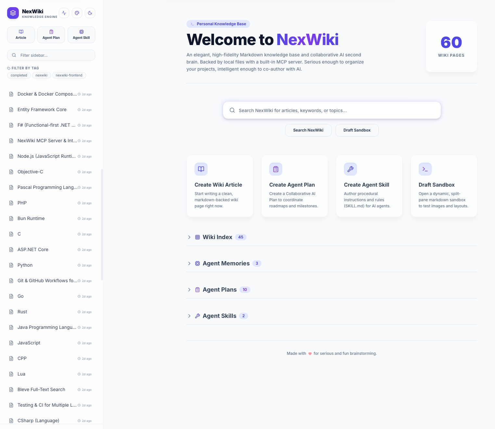

# NexWiki 🚀

**A wiki that is a first-class MCP citizen — your notes and your AI agent's memory in the same human-editable Markdown files, with an in-wiki page that governs how every connected agent behaves.**

NexWiki is a self-contained, zero-dependency knowledge base: a single Go binary with the React UI embedded, storing everything as portable Markdown on your disk. It also runs an always-on **Model Context Protocol** server, so Claude, Cursor, Copilot, and custom agents can search it, write to it, and remember through it — using 29 built-in tools over stdio or Streamable HTTP.

<!--suppress CheckImageSize -->


---

## 🧠 Why NexWiki?

Most wikis let an AI *read* them. NexWiki is built so an AI can **think in** one.

Your notes and your agent's memory live in the **same human-editable Markdown files**. An agent stores a decision as a memory, drafts a plan, and looks up what it already knows — and you open the same page in your browser, or in vim, and edit it. Nothing is locked in a database.

|  | What it means |
|---|---|
| 🤖 **MCP-native, not bolted on** | 29 tools over stdio and Streamable HTTP, serving both the current `2026-07-28` protocol revision and older clients. The data model was designed around the agent, not adapted for it. |
| 🧩 **You govern the agent, in the wiki** | A live page — [`nexwiki-agent-guidelines`](./docs/agent_integration_guide.md) — is the rulebook every connected agent loads. Edit it in your browser and the change reaches every agent immediately. No config files, no restarts. |
| 📄 **Plain files, always yours** | Every page is a conformant [OKF v0.1](https://openknowledgeformat.org) Markdown document with real YAML front matter. Edit them with any tool; NexWiki notices. |
| 🗃️ **One binary, zero dependencies** | Go server with the React UI embedded. Download it and run it. |

> **New here?** Jump to [Quick Start](#-quick-start), then [Connect your AI agent](#-connecting-to-ai-agents-via-mcp).

---

## ⚡ Quick Start

Pick whichever fits — all three give you the same server on `http://localhost:8080`.

<details open>
<summary><b>🐳 Docker (recommended)</b></summary>

```bash
docker run -d \
  -p 8080:8080 \
  -v "$(pwd)/my-wiki-data:/app/data" \
  --name my-wiki \
  --restart unless-stopped \
  ghcr.io/gruberchris/nexwiki:latest
```

Open `http://localhost:8080`. Full options, Docker Compose, and volume details: [Docker deployment](#-docker-deployment).

</details>

<details>
<summary><b>⬇️ Pre-built binary — no Docker, no toolchain</b></summary>

The easiest way to run NexWiki — no Docker, no Go toolchain required. Download the binary for your platform, make it executable, and run it.

#### 1. Download the Binary

Visit the [GitHub Releases page](https://github.com/gruberchris/nexwiki/releases) and download the binary for your platform:

| Platform | Binary filename |
|---|---|
| macOS (Apple Silicon / M-series) | `nexwiki-{VERSION}-darwin-arm64` |
| Linux x86_64 | `nexwiki-{VERSION}-linux-amd64` |
| Linux ARM64 | `nexwiki-{VERSION}-linux-arm64` |
| Windows x86_64 | `nexwiki-{VERSION}-windows-amd64.exe` |

Each release also includes a `SHA256SUMS.txt` file you can use to verify your download:
```bash
# macOS / Linux
sha256sum -c SHA256SUMS.txt --ignore-missing
```

#### 2. Make It Executable (macOS & Linux)

```bash
chmod +x nexwiki-*-darwin-arm64   # macOS
# or
chmod +x nexwiki-*-linux-amd64    # Linux x86_64
```

> **macOS note:** If macOS blocks the binary with a Gatekeeper warning, right-click the file in Finder → **Open** → **Open** to grant a one-time exception, or run: `xattr -d com.apple.quarantine ./nexwiki-*-darwin-arm64`

> **Windows note:** Windows Defender SmartScreen may show a warning for unsigned binaries. Click **More info** → **Run anyway** to proceed.

#### 3. Run with Default Settings

```bash
# macOS / Linux
./nexwiki-1.0.0-darwin-arm64

# Windows (PowerShell)
.\nexwiki-1.0.0-windows-amd64.exe
```

Open your browser to `http://localhost:8080`. NexWiki will create a `./data` directory in the current folder to store your articles and search index.

#### 4. Configuration

All settings can be set via CLI flags. The `NEXWIKI_NAME`, `NEXWIKI_THEME`, and `NEXWIKI_THEME_SCHEDULING` environment variables take precedence over their corresponding flags when both are set.

| Option | CLI Flag | Env Variable | Default | Description |
|---|---|---|---|---|
| HTTP port | `-port` | — | `8080` | Port the web server listens on |
| Data directory | `-data` | — | `./data` | Directory for articles, assets, and the search index |
| Wiki name | `-name` | `NEXWIKI_NAME` | `NexWiki` | Title displayed in the UI and HTML headers |
| Default theme | `-theme` | `NEXWIKI_THEME` | `default` | Initial active color theme |
| Seasonal themes | `-theme-scheduling` | `NEXWIKI_THEME_SCHEDULING` | `false` | Enable automatic annual seasonal theme switching |
| Stdio MCP-only mode | `-mcp-only` | `NEXWIKI_MCP_ONLY` | `false` | Run as a pure stdio MCP server, skipping the web port bind entirely. Required when spawning a stdio MCP subprocess alongside an already-running web server |
| Archive auto-delete | — | `NEXWIKI_AUTO_DELETE_ARCHIVED_AFTER_DAYS` | `0` (disabled) | Days after archiving before an article is permanently deleted on startup |
| Plan lifecycle interval | — | `NEXWIKI_PLAN_LIFECYCLE_INTERVAL_DAYS` | `1` | How often the plan lifecycle worker sweeps (it also sweeps once at startup) |
| Plan auto-archive | — | `NEXWIKI_PLAN_ARCHIVE_AFTER_DAYS` | `90` | Days a plan stays `completed`/`superseded` before auto-archiving (`0` disables) |
| Plan auto-delete | — | `NEXWIKI_PLAN_DELETE_AFTER_DAYS` | `365` | Days a plan stays `archived` before permanent deletion (`0` disables; plans with inbound links are never auto-deleted) |
| Plan lifecycle dry-run | — | `NEXWIKI_PLAN_LIFECYCLE_DRY_RUN` | `false` | Log intended plan transitions without applying them |
| Activity archive cap | — | `NEXWIKI_ACTIVITY_MAX_ARCHIVES` | unlimited | Maximum number of rotated `activity-<UTC>.jsonl` archives to retain |
| Agent attribution | `-agent-name` | `NEXWIKI_AGENT_NAME` | (unset) | Name recorded in the activity log for MCP clients that do not identify themselves. Clients sending MCP `clientInfo` are credited by their own name regardless. **Not** the same as `-name`, which is the wiki's display title |
| Bind interface | `-bind` | `NEXWIKI_BIND` | (all interfaces) | Network interface to bind, e.g. `127.0.0.1` to accept only local connections. Leave unset for Docker |
| Extra browser origins | — | `NEXWIKI_ALLOWED_ORIGINS` | (loopback only) | Comma-separated origins allowed to call the API from a browser, e.g. `https://wiki.example.com`. Needed only when serving NexWiki from a DNS name |

> **Bind-or-halt:** a normal launch *is* the web server — it binds the port or exits rather than silently falling back. To run a stdio MCP server next to an already-running instance, use `-mcp-only`.

> 🔒 **Trust model — NexWiki is unauthenticated.** There are no accounts or passwords: anyone who can reach the port has full read/write/delete access to your wiki *and* to every MCP tool. NexWiki is built for a single user on a trusted machine or private network. Don't put it on the public internet without a VPN or an authenticating proxy in front of it. Browser requests from unknown origins are rejected by default; see [SECURITY.md](./SECURITY.md).

#### 5. Examples

```bash
# macOS / Linux — custom port, data directory, and wiki name
./nexwiki-1.0.0-darwin-arm64 \
  -port=9090 \
  -data=/home/user/my-wiki-data \
  -name="My Personal Brain"

# macOS / Linux — enable seasonal themes via environment variable
NEXWIKI_NAME="Team Wiki" NEXWIKI_THEME_SCHEDULING=true \
  ./nexwiki-1.0.0-linux-amd64 -data=/var/wiki/data

# Windows (PowerShell) — custom name and data path
$env:NEXWIKI_NAME="My Knowledge Base"
.\nexwiki-1.0.0-windows-amd64.exe -data="C:\Users\user\wiki-data" -port=9090
```

---

</details>

<details>
<summary><b>🛠️ Build from source</b></summary>

If you are a developer looking to modify the Go backend or React frontend locally, you can run them directly on your machine.

#### Prerequisites
- **Go**: 1.26 or later
- **Node.js**: 20.x or later (includes `npm`)

#### 1. Build the Frontend
To compile the static React assets so the Go server can embed them, you can choose one of the following paths:

**Option A: Manual CLI Commands**
```bash
cd frontend
npm install
npm run build
cd ..
```

**Option B: Makefile Command**
```bash
make build-frontend
```

#### 2. Build & Start the Backend
Once the frontend assets exist in `frontend/dist/`, you can compile and start the Go server:

**Option A: Manual CLI Commands**
```bash
go build -o nexwiki main.go
./nexwiki -port=8080 -data=./data -name="NexWiki Development"
```

**Option B: Makefile Command**
*(This compiles both the frontend assets and backend binary in a single command)*
```bash
make
./nexwiki -port=8080 -data=./data -name="NexWiki Development"
```
Now, you can access the combined app at `http://localhost:8080`.

#### 3. Frictionless Frontend Dev Mode (Hot-Reloading)
For active frontend development, you don't want to rebuild every time. Instead, run Vite's development server:
```bash
# Terminal 1: Run Vite's hot-reloading dev server
cd frontend
npm run dev

# Terminal 2: Run Go API backend server
go run main.go -port=8080 -data=./data
```
The Go backend includes a built-in CORS middleware that automatically permits requests from Vite's local dev server (`http://localhost:5173`).

---

</details>

## 🤖 Connecting to AI Agents via MCP

Because NexWiki contains an embedded Model Context Protocol (MCP) server, you can attach it to your favorite AI tools to query your personal wiki.

### Connecting over Streamable HTTP (Recommended)

NexWiki supports the [Streamable HTTP transport](https://modelcontextprotocol.io/specification/2026-07-28/basic/transports/streamable-http) at `/api/mcp`, and is **dual-era**: it serves the current `2026-07-28` protocol revision *and* older initialize-based clients on the same endpoint, with no configuration. This allows modern MCP clients to connect over the network rather than stdio pipes — reusing the single running server process and avoiding search-index lock contention entirely.

```json
{
  "mcpServers": {
    "nexwiki": {
      "url": "http://localhost:8080/api/mcp"
    }
  }
}
```

### Connecting Claude Desktop (Stdio)
Use stdio only when you are not running the web interface, or when your client cannot speak HTTP. Add the following to your Claude Desktop configuration file (typically located at `~/Library/Application Support/Claude/claude_desktop_config.json` on macOS or `%APPDATA%\Claude\claude_desktop_config.json` on Windows).

> ⚠️ **`-mcp-only` is required.** A normal launch binds the web port or halts. Without this flag the spawned subprocess collides with your running instance and exits with `Fatal: could not bind web server`.

**Option A: Running via Docker**
```json
{
  "mcpServers": {
    "nexwiki": {
      "command": "docker",
      "args": ["exec", "-i", "personal-wiki", "/app/nexwiki", "-mcp-only", "-data", "/app/data"]
    }
  }
}
```
`docker exec` bypasses the image ENTRYPOINT, so `-mcp-only` and `-data` must both be passed explicitly.

Because the container already runs a web server owning that data directory, the sidecar automatically runs as a **proxy** to it: one process owns the wiki, and the sidecar forwards MCP traffic to it — including live subscription streams. See [Sidecar proxy mode](./docs/mcp_server.md#-sidecar-proxy-mode).

**Option B: Running the Go Binary directly**
```json
{
  "mcpServers": {
    "nexwiki": {
      "command": "/path/to/your/compiled/nexwiki",
      "args": ["-mcp-only", "-data", "/path/to/your/wiki-data"]
    }
  }
}
```

### The NexWiki Agent Skill (works with any agent CLI)

Connecting the MCP server gives your agent the *tools*. The **agent skill** is what makes it actually reach for them — storing plans and memories, and looking things up — without you prompting it every time.

The skill is a single folder, [`agent-skill/nexwiki/`](./agent-skill/nexwiki), following the vendor-neutral [Agent Skills](https://agentskills.io) standard (a `SKILL.md` in its own folder). The same folder works across Claude Code, GitHub Copilot CLI, opencode, OpenAI Codex, and Google Antigravity.

1. **Connect the MCP server** (above), e.g. `claude mcp add --transport http nexwiki http://localhost:8080/api/mcp`.
2. **Copy the `agent-skill/nexwiki/` folder** into your agent's `skills/` directory — project scope to share it with a repo, or home scope to reuse it everywhere:

| Agent CLI | Project scope | Home scope (reuse everywhere) |
|---|---|---|
| **Claude Code** | `.claude/skills/nexwiki/` | `~/.claude/skills/nexwiki/` |
| **GitHub Copilot CLI** | `.github/skills/nexwiki/` | `~/.copilot/skills/nexwiki/` |
| **opencode** | `.opencode/skills/nexwiki/` | `~/.config/opencode/skills/nexwiki/` |
| **OpenAI Codex** | `.codex/skills/nexwiki/` | `~/.codex/skills/nexwiki/` |
| **Google Antigravity** (`agy`) | `.agents/skills/nexwiki/` | `~/.gemini/antigravity-cli/skills/nexwiki/` |

```bash
# reuse across all your Claude Code projects
mkdir -p ~/.claude/skills && cp -r agent-skill/nexwiki ~/.claude/skills/
```

Agents load it automatically when relevant, or invoke it explicitly with `/nexwiki` (Claude Code, Copilot CLI). Because the `skills/` convention is shared, `~/.claude/skills/nexwiki/` alone is picked up by Claude Code, Copilot CLI, and opencode. Full per-tool paths and tips: [`agent-skill/README.md`](./agent-skill/README.md).

**To change how agents behave, don't edit the copied skill.** It points every agent at a live wiki page — `nexwiki-agent-guidelines` — which NexWiki seeds automatically on first start. Edit it in your browser and the change reaches every connected agent immediately, with no re-copying and no restart.

---

## ✨ Features

- **📦 Zero-Dependency Single Binary**: Frontend-compiled assets are embedded directly inside the Go web server executable using Go's `go:embed`. No external asset servers are required.
- **⚡ Modern Responsive UI**: A sleek, high-fidelity Single Page Application (SPA) built using React 19, TypeScript, Vite, Lucide Icons, and styled with Tailwind CSS (v3).
- 🏷️ **Dynamic Tagging & Navigation**: Organize note files using custom tags. Filter documents instantly using the interactive sidebar Tag Cloud, add/remove tags in the split-editor, and perform global tag deletion with one click.
- 📚 **Native OKF Storage & Document `type`**: Every `.md` file is a conformant **Open Knowledge Format (OKF v0.1)** concept document at rest (real YAML front matter). Each document carries a `type` — `Wiki` or one of the reserved `AI-Agent-Memory` / `AI-Agent-Plan` / `AI-Agent-Skill` classes (set only by the agent tools). NexWiki ships full bidirectional **OKF bundle import/export** (`export_okf_bundle` / `import_okf_bundle`, REST `GET/POST /api/okf/*`).
- 🤖 **Isolated & Protected AI Memories**: Dedicated, secure support for AI-created memories (plans, troubleshooting guides, decisions, todos, rules) carried by the reserved `AI-Agent-Memory` document `type`, with an optional tool-managed `memory-<scope>` tag for project/topic scope. These pages are isolated and auto-excluded from default searches. Standard users cannot relabel a document's reserved type or forge memory-scope tags, but they have full freedom to edit and delete the documents and their free tags.
- 🛠️ **AI Agent Skills & Custom Registry**: Create, edit, delete, and manage custom AI Agent skills (procedural instructions) inside the wiki. Skills carry the reserved `AI-Agent-Skill` type and are isolated inside a dedicated **Collapsible Sidebar Folder**. It registers dedicated REST API routes (`GET /api/skills`, `GET /api/skills/{slug}`, and `GET /api/skills/{slug}/raw`) allowing third-party tools (like JetBrains AI Assistant, custom agents, or Claude Code) to easily consume the wiki as a custom, dynamic Skills Registry.
- 📎 **MCP Resources & Live Subscriptions**: Every document is exposed as an MCP resource at `nexwiki://article/{slug}`, so you can `@`-mention a wiki page directly in Claude Desktop or Cursor — no tool call, no tokens spent on tool-result prose. And `subscriptions/listen` turns NexWiki into a **live, subscribable knowledge base**: an agent holding a subscription is notified the instant you edit a page in the browser or another agent writes a memory.
- 🏷️ **MCP Tool Annotations**: Every tool declares what it does — `readOnlyHint` on the 14 tools that never modify the wiki, `destructiveHint` on the 9 that can overwrite or remove content, and `openWorldHint: false` on all 29 because NexWiki never reaches outside your local wiki. Clients use these to auto-approve safe reads instead of interrupting you to confirm `get_context_overview`.
- **🤖 Built-in MCP Server & Agent Governance**: Exposes twenty-nine powerful Model Context Protocol tools (including dedicated, cleanly separated tools for managing AI memories, collaborative AI plans, custom AI skills, and OKF import/export) to AI clients via Stdio and Streamable HTTP. A normal launch binds the web port or halts; an explicit **`-mcp-only`** flag runs a pure stdio MCP server alongside a web primary. Includes native support for **MCP Prompts Protocol**, strict tool schema rules, programmatic plan editing (`edit_agent_plan` and `edit_agent_skill` support full content replacement and metadata updates), and full memory lifecycle hygiene (`edit_agent_memory`, `delete_agent_memory`, with `delete_wiki_article` refusing protected memories).
- 🧠 **Progressive Disclosure, Provenance & Backlinks**: Every article supports optional one-line `description`, a `source` (citation) field, and an OKF `resource` (the canonical URI of the concept). The `get_context_overview` MCP tool serves a compact sectioned index of the whole wiki so agents orient cheaply before reading selectively, and `get_backlinks` + a "Linked from" viewer panel make graph traversal bidirectional. Both internal link forms count — `[[WikiLinks]]` and absolute `[text](/articles/slug)` Markdown links — so backlinks, orphan detection, and broken-link detection all see the same wiki. Renaming an article auto-heals inbound links in both forms.
- 🪵 **Durable Activity Log**: All REST and MCP activity events persist to an append-only `data/activity.jsonl` (JSON Lines) with **non-destructive, timestamped archives** on rotation (no history lost). The `get_recent_activity` MCP tool and the paginated Activity Drawer ("Load older history", `GET /api/activity/log`) read across archives so agents and humans can ask "what changed since my last session?" with duration/timestamp, action, and source filters.
- **🔍 Blazing-Fast Full-Text Search**: Powered by the robust `github.com/blevesearch/bleve/v2` engine. Supports advanced query parsing, scoring, and text snippet highlighting.
- **📂 Flat-File Markdown Storage**: Wiki pages are stored on disk as plain Markdown files with real YAML front matter metadata (OKF v0.1). Your files remain completely portable and easily readable by external editors.
- 🕒 **Gzipped Flat-File Versioning**: Built-in revision engine that saves highly efficient compressed `.md.gz` gzip snapshots of your article history. Review historical changes side-by-side using interactive **Split Pane** or **Unified Inline** diff modes, roll back changes instantly, and prevent session write conflicts with automatic optimistic locking guards.
- 📤 **Export, Share, Copy & Backup/Restore**: Export any wiki article directly to a professional print-styled PDF, Microsoft Word (`.docx`), or standard Markdown (`.md`). Instantly copy raw body text or page URLs from a glassmorphic dropdown. **Backup** your entire wiki — all articles, AI memories, plans, and skills — as a portable OKF v0.1 bundle (`.zip`) in one click from the sidebar, and **Restore** it on any NexWiki instance (including a fresh install) using the companion Restore button. The bundle round-trips perfectly: all metadata, tags, types, and WikiLinks are preserved.
- 🖼️ **Asset & Image Uploads**: Built-in support for uploading and referencing media assets (such as PNG, JPEG, GIF, SVG, and WebP) directly within articles.
- 🔄 **Lifecycle Status as a First-Class Field**: Status lives in a dedicated `status` front-matter field rather than being smuggled into the tag list — a single value with a state machine, not a folksonomy entry. Agent plans have a closed, enforced vocabulary of eight states (`draft`, `implementing`, `blocked`, `completed`, `superseded`, `parked`, `evergreen`, `archived`) and agent skills their own (`draft`, `ready`, `archived`); an unrecognized value, or a lifecycle word smuggled in as a tag, is rejected with a message naming the right one, so agents cannot invent statuses. **Wiki articles and memories have no status and no tag rules at all** — tag them however you like. A background worker automates the tail of the plan lifecycle: `completed`/`superseded` plans auto-archive after a configurable period and `archived` plans are eventually deleted — with a dry-run mode, a full activity-log audit trail, a backlink guard that refuses to delete referenced plans, and timer-exempt `parked`/`evergreen` states. A one-time startup migration moves plan and skill status tags into the field, and drops the retired status tags from wiki articles and memories.
- 📊 **Native Mermaid Diagrams**: ```` ```mermaid ```` fenced code blocks render as theme-aware SVG diagrams in the article viewer, the editor's live preview, and print/PDF exports. The ~800KB library is lazy-loaded only by pages that actually contain a diagram, wide diagrams scroll in their own container, and a diagram with a syntax error falls back to its source code with an inline note instead of a blank hole.
- 🖥️ **Reader & Dashboard Experience**: The reading column scales responsively up to 4K displays instead of staying a 672px ribbon, the home dashboard's Agent Plans section defaults its filter to `!completed` (visible and clearable like any typed filter), Back/Forward restores the dashboard — filters, expanded sections, and scroll position — exactly as you left it, and every filter autosuggestion dropdown is a proper ARIA combobox navigated with the arrow keys (Tab moves focus, as it should).
- **⚙️ Dynamic Customization**: Personalize your wiki's name via environment variables (`NEXWIKI_NAME`) or command-line flags.
- 🎨 **Seasonal Theme Scheduling & Customizable Palettes**: Configure default themes via CLI flags or environment variables, customize dual-variant (Light/Dark) palettes using custom pickers, and schedule annual seasonal themes (`independence-day`, `halloween`, `christmas`, `new-years`) using CLI flags (`-theme-scheduling`) or environment parameters (`NEXWIKI_THEME_SCHEDULING`). Features scheduled badges and a deterministic overlap date hash resolver.
- 💻 **IDE-Grade CodeMirror 6 Editor & Cheat Sheet**: Replaced the primitive textarea with CodeMirror 6, complete with auto-resizing, Tab-indent formatting, image drag-and-drop, and clean transactional toolbar formats. Pressing `Ctrl+/` / `Cmd+/` instantly overlays a glassmorphic Markdown Syntax cheat cheatsheet. Integrates dynamic colors wrapping active themes (Option B) natively at runtime.
- 🔍 **Real-Time Markdown Linter & Inline Warnings**: Debounced validation checks your writing against standard rules (MD001 hierarchy, MD025 multiple H1s, MD037 interior spacing, MD034 bare URLs) and broken internal links in both forms — `[[WikiLinks]]` and `[text](/articles/slug)`. Shows severity wavy underlines, hover details/quick fixes, right-click custom context menus, and a rich Diagnostics Dashboard modal with sorting, filters, cursor jumps, and AI Correction prompt copy tools.
- 📡 **Real-Time SSE Syncing & Live Activity Log**: Establish single global `EventSource` connections over `/api/activity/stream` backed by a thread-safe circular `EventBus` (caching the last 200 operations). Rapid AI tool mutations are buffered in a 500 ms cooldown window to show cumulative glowing badges (Option B), and live operations (REST API vs. MCP AI tools) stream to a slide-in Activity Drawer. Drives instant zero-refresh dashboard stats and active reader content synchronization.
- **🔒 Development Safety**: System logs are directed exclusively to standard error (`Stderr`) to prevent stdout corruption, guaranteeing stable MCP JSON-RPC Stdio piping.

---

---

## 🐳 Docker Deployment

NexWiki publishes a ready-to-run multi-platform Docker image to the [GitHub Container Registry](https://github.com/gruberchris/nexwiki/pkgs/container/nexwiki) on every release. No build step is needed.

**Image**: `ghcr.io/gruberchris/nexwiki`  
**Platforms**: `linux/amd64`, `linux/arm64` (runs natively on Apple Silicon via Docker Desktop)

#### Prerequisites
Ensure you have [Docker Desktop](https://www.docker.com/products/docker-desktop/) installed and running.

#### 1. Pull the Image

```bash
# Latest release
docker pull ghcr.io/gruberchris/nexwiki:latest

# Or a specific version
docker pull ghcr.io/gruberchris/nexwiki:1.0.0
```

#### 2. Run with `docker run`

**Minimal (defaults):**
```bash
docker run -d \
  -p 8080:8080 \
  -v "$(pwd)/my-wiki-data:/app/data" \
  --name my-wiki \
  --restart unless-stopped \
  ghcr.io/gruberchris/nexwiki:latest
```

**With full configuration:**
```bash
docker run -d \
  -p 9090:9090 \
  -v "$(pwd)/my-wiki-data:/app/data" \
  -e NEXWIKI_NAME="My Personal Brain" \
  -e NEXWIKI_THEME="default" \
  -e NEXWIKI_THEME_SCHEDULING="true" \
  --name my-wiki \
  --restart unless-stopped \
  ghcr.io/gruberchris/nexwiki:latest \
  -port=9090
```

> **Note:** When changing the port with `-port`, you must also update the `-p` host mapping (e.g., `-p 9090:9090`).

#### 3. Run with Docker Compose

Save the following as `docker-compose.yml` and run `docker compose up -d`:

```yaml
services:
  wiki:
    image: ghcr.io/gruberchris/nexwiki:latest
    container_name: my-wiki
    environment:
      - NEXWIKI_NAME=My Personal Brain
      - NEXWIKI_THEME=default
      # - NEXWIKI_THEME_SCHEDULING=true   # Uncomment to enable seasonal themes
    volumes:
      - wiki-data:/app/data
    ports:
      - "8080:8080"
    restart: unless-stopped

volumes:
  wiki-data:
    driver: local
```

Open your browser to `http://localhost:8080`.

#### Understanding the Volume Mount (`/app/data`)

The `/app/data` directory inside the container holds all persistent state:
- `articles/` — All your Markdown wiki files.
- `assets/` — Uploaded images and media attachments grouped by article.
- `search.bleve/` — The Bleve full-text search index database.
- `activity.jsonl` — The durable activity event log. At 10 MB it is rotated into a timestamped `activity-<UTC>.jsonl` archive; rotation repeats as needed and never overwrites earlier archives.

Always mount this path to a persistent local directory or named Docker volume to preserve your data across container restarts and upgrades.

#### Configuration

| Env Variable | Default | Description |
|---|---|---|
| `NEXWIKI_NAME` | `NexWiki` | Title displayed in the UI and HTML headers |
| `NEXWIKI_THEME` | `default` | Initial active color theme |
| `NEXWIKI_THEME_SCHEDULING` | `false` | Set to `true` to enable seasonal auto theme switching |
| `NEXWIKI_MCP_ONLY` | `false` | Run as a pure stdio MCP server, skipping the web port bind |
| `NEXWIKI_AUTO_DELETE_ARCHIVED_AFTER_DAYS` | `0` (disabled) | Days after archiving before an article is permanently deleted on startup |
| `NEXWIKI_PLAN_LIFECYCLE_INTERVAL_DAYS` | `1` | How often the plan lifecycle worker sweeps |
| `NEXWIKI_PLAN_ARCHIVE_AFTER_DAYS` | `90` | Days a plan stays `completed`/`superseded` before auto-archiving (`0` disables) |
| `NEXWIKI_PLAN_DELETE_AFTER_DAYS` | `365` | Days a plan stays `archived` before permanent deletion (`0` disables) |
| `NEXWIKI_PLAN_LIFECYCLE_DRY_RUN` | `false` | Log intended plan transitions without applying them |
| `NEXWIKI_ACTIVITY_MAX_ARCHIVES` | unlimited | Maximum number of rotated `activity-<UTC>.jsonl` archives to retain |
| `NEXWIKI_ALLOWED_ORIGINS` | (loopback only) | Comma-separated browser origins allowed to call the API, e.g. `https://wiki.example.com`. Needed only when serving NexWiki from a DNS name |

The image ENTRYPOINT defaults to `-port=8080 -data=/app/data`. The simplest approach is to leave both alone and adjust the `-p` host mapping and volume mount instead. If you do need a different in-container port, append `-port=<n>` after the image name (as shown above) — trailing flags override the ENTRYPOINT defaults — and update `-p` to match.

---

The fastest way to get NexWiki up and running locally is using **Docker** and **Docker Compose**.

#### 1. Prerequisites
Ensure you have [Docker Desktop](https://www.docker.com/products/docker-desktop/) installed and running on your machine.

#### 2. Run with Docker Compose (Recommended)
We provide a standard `docker-compose.yml` that mounts a persistent local data volume to preserve your wiki articles.

> 💡 **Tip:** When making code updates during local development, run `docker compose up -d --build` to automatically rebuild the image with your latest changes and deploy the updated container in the background (detached mode).

1. Navigate to the project root directory.
2. Run the following command:
   ```bash
   docker compose up --build
   ```
3. Once the build and application startup completed, open your browser and navigate to:
   ```
   http://localhost:8080
   ```
4. You will see your newly initialized wiki with a default seeded homepage ready to edit!

#### 3. Run with Docker CLI (Manual)
If you prefer running the container manually without Docker Compose:

1. **Build the Docker Image**:
   ```bash
   docker build -t nexwiki:latest .
   ```
2. **Run the Container**:
   ```bash
   docker run -d \
     -p 8080:8080 \
     -v "$(pwd)/my-wiki-data:/app/data" \
     -e NEXWIKI_NAME="My Personal Wiki" \
     --name personal-wiki \
     --restart unless-stopped \
     nexwiki:latest
   ```

#### Understanding the Volume Mount (`/app/data`)
The Docker container maps `/app/data` to your local machine (`./my-wiki-data` in compose or the path specified in CLI). This directory contains:
- `articles/` - All your Markdown wiki files (e.g., `home.md`, `setup-guide.md`).
- `assets/` - Uploaded images and media attachments grouped by article.
- `search.bleve/` - The Bleve full-text search index database.
- `activity.jsonl` - The durable activity event log. At 10 MB it is rotated into a timestamped `activity-<UTC>.jsonl` archive; rotation repeats as needed and never overwrites earlier archives.

---

## 🛠️ Build Automation & Multi-Platform Cross-Compilation (Makefile)

We provide a robust `Makefile` to simplify frontend compilation, local builds, Docker controls, and cross-compiling the self-contained zero-dependency binary for various architectures.

> 💡 **Tip:** Always make sure the frontend assets are compiled (`make build-frontend`) before running compilation steps, since Go's standard `embed` library will fail to build if `frontend/dist/` is empty. The Makefile cross-compilation targets automatically trigger this step for you.

### Core Developer Targets
* **Build Everything (Frontend + Backend for Host)**:
  ```bash
  make
  # or: make all
  ```
* **Clean Artifacts**: Removes the host binary, `bin/` directory, and compiled frontend assets:
  ```bash
  make clean
  ```

### Docker Compose Automation
* **Build and Spin Up Containers in the background**:
  ```bash
  make docker-up
  ```
* **Shut Down Container Service**:
  ```bash
  make docker-down
  ```
* **Build Raw Docker Image**:
  ```bash
  make docker-build
  ```

### Cross-Compilation Targets
All cross-compiled binaries are saved inside the `./bin/` directory:
* **Windows (AMD64)**:
  ```bash
  make build-windows-amd64
  ```
* **Linux (AMD64)**:
  ```bash
  make build-linux-amd64
  ```
* **Linux (ARM64)**:
  ```bash
  make build-linux-arm64
  ```
* **macOS (ARM64 / Apple Silicon)**:
  ```bash
  make build-macos-arm64
  ```
* **Compile for All Platforms Simultaneously**: Builds binaries for all the above operating systems and architectures in one go:
  ```bash
  make build-all-platforms
  ```

---

## 🚢 Production Deployment

When deploying NexWiki for production use, containerized deployments are highly recommended due to the zero-dependency nature of the single compiled binary.

> 🔒 **Before you deploy: NexWiki has no authentication.** No accounts, no passwords, no API tokens. Anyone who can reach the port can read, edit, and delete every article and drive every MCP tool. The TLS/reverse-proxy configurations below encrypt traffic — they do **not** restrict who may connect.
>
> If NexWiki needs to be reachable beyond your own machine, put an authenticating layer in front of it: a VPN (Tailscale, WireGuard), an identity-aware proxy, or your reverse proxy's own auth (Caddy `basic_auth`, `oauth2-proxy`). When serving from a domain, also set `NEXWIKI_ALLOWED_ORIGINS` to that origin so browser requests are accepted. See [SECURITY.md](./SECURITY.md) for the full trust model.

### 1. Core Deployment Requirements
- **Persistent Volume**: Since NexWiki stores articles as flat files and hosts the Bleve database on disk, **you must mount a persistent volume** to `/app/data`. If using cloud platforms (like AWS ECS, GCP Cloud Run, fly.io, or DigitalOcean), make sure to attach a persistent block store or network file share (like EFS or GCP Persistent Disk).
- **Environment Variables**:
  - `NEXWIKI_NAME`: Configure the title of your wiki shown on the page and in the HTML headers (e.g. `NEXWIKI_NAME="Company Knowledge Base"`).
  - `NEXWIKI_THEME`: Configure the initial active default theme.

### 2. Production Docker Compose Setup
Create a `docker-compose.prod.yml` behind a reverse proxy:

```yaml
services:
  wiki:
    image: nexwiki:latest  # Or pull from your container registry
    container_name: production-wiki
    environment:
      - NEXWIKI_NAME=Company Wiki
    volumes:
      - wiki-prod-data:/app/data
    ports:
      - "8080:8080"
    restart: always

volumes:
  wiki-prod-data:
    driver: local
```

### 3. Setting Up SSL & Reverse Proxy (Caddy / Nginx)
It is highly recommended to terminate SSL (HTTPS) before requests reach the NexWiki server. Below is a simple config snippet if you are using [Caddy](https://caddyserver.com/) as a secure reverse proxy:

```caddy
wiki.yourdomain.com {
    # NexWiki has no authentication of its own — the proxy must provide it.
    # Generate the hash with: caddy hash-password
    basic_auth {
        yourname $2a$14$replace.with.your.own.bcrypt.hash
    }

    reverse_proxy localhost:8080
}
```

Run NexWiki with `NEXWIKI_ALLOWED_ORIGINS=https://wiki.yourdomain.com` so browser requests from that domain are accepted.

If using **Nginx**, you must bypass proxy buffering for NexWiki's two streaming endpoints: `/api/mcp` (Streamable HTTP MCP transport) and `/api/activity/stream` (the `EventSource` feed powering the live Activity Drawer and zero-refresh dashboard sync). Without this, both silently stall behind Nginx's default buffering:

```nginx
server {
    listen 443 ssl;
    server_name wiki.yourdomain.com;

    location / {
        proxy_pass http://localhost:8080;
        proxy_set_header Host $host;
        proxy_set_header X-Real-IP $remote_addr;
    }

    # Streaming endpoints: disable buffering for Streamable HTTP MCP
    # and the live activity SSE stream.
    location ~ ^/api/(mcp|activity/stream)$ {
        proxy_pass http://localhost:8080;
        proxy_set_header Host $host;
        proxy_set_header X-Real-IP $remote_addr;
        proxy_buffering off;
        proxy_cache off;
        proxy_set_header Connection '';
        chunked_transfer_encoding off;
        proxy_read_timeout 24h;
    }
}
```

---

## 📚 Documentation

For in-depth user manuals and technical descriptions of NexWiki's capabilities, visit our [Documentation Hub](./docs/README.md).
