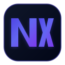
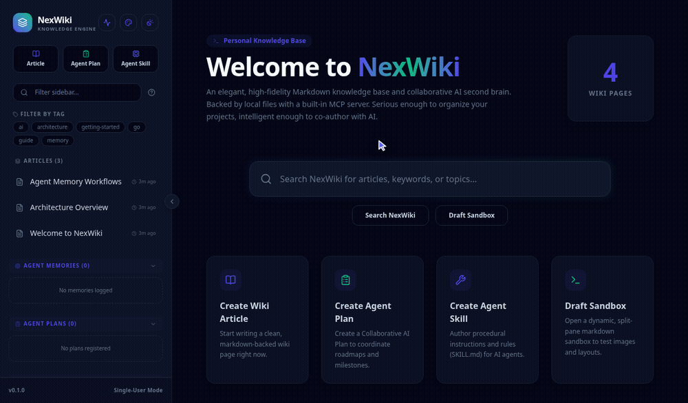

#  NexWiki

**The personal context consolidation repository and AI verification foundation.**

---

## 🧠 Why NexWiki?

Personal, individual context is scattered across disconnected tools—random scratch notes in note applications, loose Markdown files strewn across drives and folders, technical decisions buried in Microsoft Teams or Slack channels, and critical snippets inside email messages.

NexWiki's mission is to give you a single, local, human-readable place to relocate and unify all of that data—even when raw, unformatted, or incomplete.

Connect your AI agent harness apps—including **Claude Code**, **GitHub Copilot CLI**, **Google Antigravity**, **OpenAI Codex**, **OpenCode**, and **Cursor**—to ingest, organize, and reason over this unified context. This establishes a powerful dual payoff:

1. **Accelerate Building**: Leverage your accumulated knowledge and personal context to help you design and build new solutions faster.
2. **Ground Truth Verification**: Empower your agents to use that personal context to verify that what they are building is actually correct and compliant with your standards.

### 🖥️ Interactive Web UI
Experience creating, formatting, and organizing articles in NexWiki's responsive web interface.



### 🤖 AI Agent MCP Ingestion
Watch an AI agent harness ingest an unformatted Slack decision snippet into NexWiki over MCP and instantly query the newly grounded context.


---

## ⚡ Quick Start

Get NexWiki up and running on `http://localhost:5808` in seconds.

### 1. Installation

#### Binary Installation (Recommended)
Installs the pre-compiled, SHA256-verified standalone binary for your OS and architecture:

- **macOS / Linux**:
  ```bash
  curl -fsSL https://raw.githubusercontent.com/gruberchris/nexwiki/main/scripts/install.sh | bash
  ```
  *(or run `./scripts/install.sh` from a cloned repo)*

- **Windows (PowerShell)**:
  ```powershell
  irm https://raw.githubusercontent.com/gruberchris/nexwiki/main/scripts/install.ps1 | iex
  ```
  *(or run `.\scripts\install.ps1` from a cloned repo)*

#### Docker Container Runner (Alternative)
Pulls the latest multi-arch image (`ghcr.io/gruberchris/nexwiki:latest`) and automatically mounts your OS data directory:

- **macOS / Linux**:
  ```bash
  curl -fsSL https://raw.githubusercontent.com/gruberchris/nexwiki/main/scripts/docker-run.sh | bash
  ```
  *(or run `./scripts/docker-run.sh` from a cloned repo)*

- **Windows (PowerShell)**:
  ```powershell
  irm https://raw.githubusercontent.com/gruberchris/nexwiki/main/scripts/docker-run.ps1 | iex
  ```
  *(or run `.\scripts\docker-run.ps1` from a cloned repo)*

### 2. Launching

Start the server and automatically open the application in your default web browser:

```bash
nexwiki -launch-in-browser
```

On first launch, NexWiki automatically creates its data directory (`articles/`, `assets/`, `history/`, and search index) in your OS standard directory (`~/.config/nexwiki/nexwiki-data` on macOS/Linux, `%AppData%\nexwiki\nexwiki-data` on Windows, or `/app/data` in Docker) and seeds an initial homepage.

> 📘 For advanced CLI flags, environment variables, manual downloads, and production Docker Compose setups, see the [Install Scripts Guide](docs/install_scripts_guide.md), [Configuration Guide](docs/configuration.md), and [Docker Deployment Guide](docs/docker_deployment.md).

---

## 🤖 Connecting AI Agents via MCP

NexWiki contains an always-on Model Context Protocol (MCP) server exposing **29 built-in tools** for search, content retrieval, memory management, and agent planning.

### Streamable HTTP (Recommended)
Reuses your running web server at `http://localhost:5808/api/mcp` and sidesteps search index locks:

```json
{
  "mcpServers": {
    "nexwiki": {
      "url": "http://localhost:5808/api/mcp"
    }
  }
}
```

Add directly in **Claude Code**:
```bash
claude mcp add --transport http nexwiki http://localhost:5808/api/mcp
```

### Stdio Subprocess
When running headless without the web interface:

```json
{
  "mcpServers": {
    "nexwiki": {
      "command": "nexwiki",
      "args": ["-mcp-only", "-data", "/path/to/data"]
    }
  }
}
```
*(Note: Passing `-mcp-only` is required for stdio subprocesses to skip the web port bind).*

### Universal Agent Skill & In-Wiki Governance
- **Agent Skill**: Copy [`agent-skill/nexwiki/`](agent-skill/nexwiki/) into your agent's skills folder (`~/.claude/skills/`, `~/.copilot/skills/`, `.agents/skills/`, etc.). Built on the open [Agent Skills](https://agentskills.io) standard, it works across Claude Code, GitHub Copilot CLI, Google Antigravity, OpenCode, and OpenAI Codex. See the [Agent Skill Guide](agent-skill/README.md).
- **In-Wiki Governance**: Connected agents automatically load the live [`nexwiki-agent-guidelines`](docs/agent_integration_guide.md) wiki page on startup. Edit this page in your browser at any time to modify agent rules and behaviors—changes take effect immediately across all agents without restarts.

---

## ✨ Key Features

- **📦 Zero-Dependency Go Binary**: Standalone Go executable with the React 19 SPA embedded via `go:embed`—no external asset servers or database processes required. ([Developer Guide](docs/developer_guide.md))
- **🤖 29 Built-in MCP Tools**: Comprehensive semantic tools over Streamable HTTP and stdio, providing agents safe search, structured reads, optimistic writes, and rollback controls. ([MCP Server Guide](docs/mcp_server.md))
- **📂 Flat-File Markdown & OKF v0.2**: All pages persist as human-readable Markdown files with conformant Open Knowledge Format front matter and five trust signals (provenance, trust, freshness, lifecycle, and computations). ([OKF Guide](docs/okf_v02_guide.md))
- **🧠 Isolated AI Agent Memories & Custom Skills**: Dedicated storage for agent plans, skills, and memories, cleanly segregated from standard notes with two-axis memory classification (`memory_kind` and `memory_type`). ([Skills Guide](docs/aiagent_skills.md) · [Tags & Memory Guide](docs/tags.md))
- **🕒 Gzipped History & Visual Diffs**: Compressed `.md.gz` revision snapshots with split or unified visual diffs, instant rollbacks, and optimistic locking conflict guards. ([Version Control Guide](docs/version_control.md))
- **🔍 Bleve Full-Text Search Engine**: Embedded Bleve index with real-time indexing, boolean query expressions, term scoring, and highlighted matching snippets. ([User Guide](docs/user_guide.md))
- **📡 Real-Time SSE Updates & Activity Drawer**: Single-connection Server-Sent Events push live document edits, glowing unread badges, and detailed audit history to the slide-in Activity Drawer. ([Editor & Activity Guide](docs/editor_activity_linter_guide.md))
- **📊 Responsive 4K Reader & Mermaid Diagrams**: Viewport-scaling reading column for ultra-wide displays, native theme-aware Mermaid SVG diagram rendering, and clean PDF exports. ([Reader & Dashboard Guide](docs/reader_dashboard_guide.md))
- **📋 Rich Text Clipboard & Formatted Sharing**: One-click "Copy as Rich Text" in the Share & Export menu writes both HTML and plain text to the clipboard for formatted pasting directly into rich-text applications like Microsoft Teams, Outlook, Word, and Slack without raw markdown syntax. ([Rich Text Sharing Guide](docs/rich_text_sharing_guide.md))

---

## 📚 Documentation Hub

Explore in-depth technical manuals, architectural specifications, and workflow guides in our [Documentation Hub](docs/README.md):

- [User & Content Creation Guide](docs/user_guide.md) — Managing articles, trust signals, backlinks, and export options.
- [Second Brain Workflow Guide](docs/second_brain_workflow_guide.md) — Orientation loop, progressive disclosure, and source ingestion.
- [Model Context Protocol (MCP) Reference](docs/mcp_server.md) — Canonical reference for all 29 tools, annotations, and schemas.
- [Agent Integration & SOP Guide](docs/agent_integration_guide.md) — Governance layers, standard operating procedures, and agent blueprints.
- [Plan Lifecycle & State Machine Guide](docs/plan_lifecycle_guide.md) — Enforced plan statuses, auto-archiving, and retention timers.
- [Open Knowledge Format (OKF v0.2) Guide](docs/okf_v02_guide.md) — Trust tiers, freshness expiration, and bundle import/export.
- [Rich Text Sharing & Clipboard Guide](docs/rich_text_sharing_guide.md) — Formatting interoperability, clipboard APIs, and sharing to Teams/Slack/Outlook.
- [Configuration & CLI Flags Reference](docs/configuration.md) — Complete guide to environment variables, flags, and storage defaults.
- [Docker Deployment Guide](docs/docker_deployment.md) — Container setup, multi-arch images, and volume persistence.
- [Production Deployment & Reverse Proxy Guide](docs/production_deployment.md) — Caddy/Nginx reverse proxy, TLS, and auth boundaries.
- [Developer Setup & Build Automation Guide](docs/developer_guide.md) — Local development, Vite hot-reloading, and cross-compilation.
- [Release Engineering & Versioning Guide](docs/release_guide.md) — CI quality gates, tag automation, and semantic versioning.
