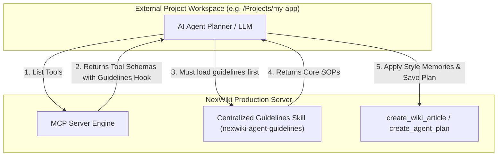

# NexWiki AI Agent Integration & SOP Guide 🤖✍️

Integrating AI coding agents (like Claude Desktop, Cursor, and GitHub Copilot) with NexWiki's Model Context Protocol (MCP) server transforms your wiki into an active, collaborative **second brain**. 

However, LLM agents are naturally "greedy planners"—they often default to writing content or creating plans purely in their chat context, or guessing formats based on general knowledge, rather than looking up your local wiki rules and saving their work.

---

## 🛑 The Production Challenge: Multi-Project Workspaces

When you deploy NexWiki in a production environment, you and other developers will be working on **other software projects** (e.g., building a Go service in `/Projects/my-go-api` or a React app in `/Projects/web-app`). 

Because you are using NexWiki as a global tool connected via MCP, **you cannot keep dropping custom `.cursorrules` or `copilot-instructions.md` files into every software repository you work on.** That is unrepeatable, inconsistent, and highly error-prone.

---

## 🏆 The Solution: Centralized Skills-Based Governance

NexWiki solves this by utilizing its native **AI Agent Skills Registry** combined with **Schema-Driven Prerequisite Hooking** to implement zero-configuration, centralized governance.



---

## 🛠️ How Skills-Based Governance Works Dynamically

### 1. Centralized "Wrench" Skill (`nexwiki-agent-guidelines`)
Instead of duplicating rules in local files across countless folders, all instructions are stored centrally inside a single, live, editable page in NexWiki named **NexWiki Agent Core Guidelines** (slug: `nexwiki-agent-guidelines`). 
* Because it is tagged with `aiagent-skill`, it is automatically registered on NexWiki's Custom AI Skills Registry.
* You can edit these agent rules directly from your browser in the NexWiki UI. **Any changes you save are instantly propagated to all connected AI agents globally.**

---

### 2. Schema-Driven Prerequisite Hooking
To ensure the agent actually reads these guidelines without any manual user prompting, we embed explicit prerequisites directly into the **MCP tool schema descriptions** (`server/mcp.go`). 

For example, the description for `create_wiki_article` is registered as:
> *`Create a brand new wiki article. (IMPORTANT: AI agents must ALWAYS load the global operational guidelines skill using 'read_article(slug: "nexwiki-agent-guidelines")' to understand formatting and style guide check requirements before executing this tool.)`*

When your agent parses these tools in *any* external workspace, the LLM planner reads this prerequisite and is **forced to execute `read_article(slug: "nexwiki-agent-guidelines")` in its first turn** before drafting or saving any content!

---

### 3. One-Time Global Client Setup (The Ultimate Best Practice)
To guarantee your agents are immediately aligned at the start of a session (before they even select a tool), you can add a single, one-time instruction to your global client configurations:

#### Option A: Claude Desktop (Global Configuration)
Open your global Claude Desktop configuration:
* **macOS**: `~/Library/Application Support/Claude/claude_desktop_config.json`
* **Windows**: `%APPDATA%\Claude\claude_desktop_config.json`

Add a custom instruction rule prompting the agent to fetch the guidelines:
```json
{
  "mcpServers": {
    "nexwiki": {
      "command": "docker",
      "args": ["exec", "-i", "personal-wiki", "/app/nexwiki"],
      "env": {
        "NEXWIKI_SYSTEM_PROMPT_MODIFIER": "You have the NexWiki MCP server registered. At the beginning of the session, always read the global operational guidelines using 'read_article(slug: \"nexwiki-agent-guidelines\")' to align on style guide lookups and task planning."
      }
    }
  }
}
```

#### Option B: Cursor (Global Custom Instructions)
1. Open Cursor **Settings** -> **Features** -> **Custom Instructions**.
2. Paste the following global instruction:
   > *"You have the `nexwiki` MCP server registered. Before writing any documentation or saving development plans, always load and follow the global agent operational guidelines skill using `read_article(slug: 'nexwiki-agent-guidelines')`."*

---

## 📖 Practical End-to-End Walkthroughs

### Walkthrough 1: Centralized Style Enforcement in an External Project
Imagine you are working in a Python service (`/Projects/python-api`) and tell Cursor/Claude: *"Add a wiki page about our new PostgreSQL database schema."*

**The Agent's Step-by-Step Execution:**
1. **Agent retrieves tools**: The agent parses the MCP tools list and sees `create_wiki_article`.
2. **Schema Hook Triggers**: The description of `create_wiki_article` warns that it *must* first load the operational guidelines.
3. **Agent loads guidelines**: The agent calls `read_article(slug="nexwiki-agent-guidelines")` and learns it must check memories for style guides.
4. **Agent checks style memories**: The agent calls `list_agent_memories(memory_type="rules")` or searches for `style guide`. It discovers `sql-dialect-article-format-template`.
5. **Agent reads template**: It calls `read_article(slug="sql-dialect-article-format-template")`, discovering the required schema table headers and syntax blocks.
6. **Agent creates page**: The agent drafts a beautiful, perfectly formatted Postgres article conforming to the wiki's rules, and saves it using `create_wiki_article`.

---

### Walkthrough 2: Auto-Saving Collaborative Plans Globally
Imagine you are working in a legacy project (`/Projects/legacy-system`) and tell your agent: *"We need to plan the migration of this legacy database to MySQL."*

**The Agent's Step-by-Step Execution:**
1. **Schema Hook Triggers**: The agent outlines a migration plan in its planner. It notes that the MCP `create_agent_plan` tool description requires it to first load `nexwiki-agent-guidelines`.
2. **Agent loads guidelines**: The agent calls `read_article(slug="nexwiki-agent-guidelines")` and confirms it must save any plans persistently in the wiki.
3. **Agent saves plan**: The agent automatically executes `create_agent_plan`, creating the page `mysql-database-migration-plan` with the `project_context` set to `legacy-system`.
4. **Agent reports slug**: The agent provides you with the slug and link, keeping both the local workspace and your knowledge base perfectly in sync.

---

### Walkthrough 3: Plan Completion Workflow
Imagine your agent has finished implementing a plan it previously created (e.g., `mysql-database-migration-plan`).

**The Agent's Step-by-Step Execution:**
1. **Agent completes implementation**: The agent finishes all the coding tasks outlined in the plan.
2. **Agent appends final notes**: The agent calls `append_agent_plan(slug="mysql-database-migration-plan")` to document the implementation: any plan deviations, files created, tools used, unexpected challenges, or other observations.
3. **Agent marks plan as completed**: The agent calls `edit_agent_plan(slug="mysql-database-migration-plan", tags=["completed"], loaded_version=<current_version>)` to add the `completed` status tag.
4. **Protected tag preserved**: The `aiagent-plan` tag is automatically preserved by the system and cannot be removed.
5. **Agent reports completion**: The agent confirms the plan is now marked as completed with final notes appended.
