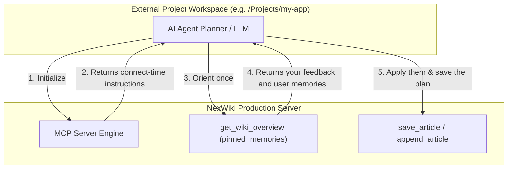

# NexWiki AI Agent Integration & SOP Guide 🤖✍️

Integrating AI coding agents (like Claude Desktop, Cursor, and GitHub Copilot) with NexWiki's Model Context Protocol (MCP) server transforms your wiki into an active, collaborative **second brain**. 

However, LLM agents are naturally "greedy planners"—they often default to writing content or creating plans purely in their chat context, or guessing formats based on general knowledge, rather than looking up your local wiki rules and saving their work.

---

## 🛑 The Production Challenge: Multi-Project Workspaces

When you deploy NexWiki in a production environment, you and other developers will be working on **other software projects** (e.g., building a Go service in `/Projects/my-go-api` or a React app in `/Projects/web-app`). 

Because you are using NexWiki as a global tool connected via MCP, **you cannot keep dropping custom `.cursorrules` or `copilot-instructions.md` files into every software repository you work on.** That is unrepeatable, inconsistent, and highly error-prone.

---

## 🏆 The Solution: Rules in the Server, Conventions in Memories

NexWiki keeps agent governance in two places, neither of which needs a file in your project repositories:

* **Universal rules live in code.** What every agent must do on every NexWiki — what a new memory must carry, that `content` replaces the whole body, what a `[[WikiLink]]` may point at, that `delete_article` is a last resort — is stated in the tool descriptions, enforced by the server where it can be, and summarised in the short **connect-time instructions** the MCP server sends when a client initializes.
* **Your conventions live in memories.** House style, corrections, and how you like work done are ordinary `AI-Agent-Memory` documents of kind `feedback` (a correction or rule you gave) or `user` (who you are and how you work). `get_wiki_overview` — the first call the instructions tell every agent to make — returns them as `pinned_memories`, and agents follow them.


```mermaid
graph TD
    subgraph External Software Project Workspace ["External Project Workspace (e.g. /Projects/my-app)"]
        Agent[AI Agent Planner / LLM]
    end

    subgraph NexWiki Production Server
        mcp[MCP Server Engine]
        overview["get_wiki_overview (pinned_memories)"]
        tools["save_article / append_article"]
    end

    Agent -->|1. Initialize| mcp
    mcp -->|2. Returns connect-time instructions| Agent
    Agent -->|3. Orient once| overview
    overview -->|4. Returns your feedback and user memories| Agent
    Agent -->|5. Apply them & save the plan| tools
```

---

## 🛠️ How It Works

### 1. Connect-time instructions
The MCP server returns short, generic **`instructions`** when a client initializes (`agentInstructions()` in `server/mcp_modern.go`), which MCP clients place in the model's context before it selects any tool:
> *`NexWiki is the user's persistent second brain: keep plans, durable facts and prior knowledge here, not only in chat. At session start call get_wiki_overview once — its pinned_memories are the operator's standing preferences and corrections; follow them. Search with search_wiki or list_articles before writing. Save multi-step work as save_article(type: "AI-Agent-Plan", project_context) and durable facts as save_article(type: "AI-Agent-Memory") with memory_kind, description and source. Session discipline: run each orientation call once; a "not found" is an answer, not a reason to search again; on a version conflict, retry once with the version the error names.`*

They name no document. Every client injects them into every session, so they stay short, and anything a single tool enforces is said in that tool's own description instead.

**Orientation is bounded on purpose.** An agent told to satisfy a precondition "before" every write treats it as something to re-check on every attempt; combined with a "search for a style guide before writing" rule, that closes a cycle — intent to create → re-check → search → intent to create — with no exit. Smaller local models generally do not track which prerequisites they have already satisfied and will alternate between lookups until they are stopped. So the instructions say to orient *once*, and that a search returning nothing is an answer. The server backs this up: `search_wiki` notices a repeated question and says so (see the [repeat-lookup damper](mcp_server.md#-the-repeat-lookup-damper)).

### 2. Your conventions as pinned memories
To teach every connected agent a convention of yours, save it as a memory:

```jsonc
save_article({
  "type": "AI-Agent-Memory", "memory_kind": "feedback",
  "title": "Article headers use sentence case",
  "description": "Headers in wiki articles are sentence case, not title case",
  "source": "operator preference",
  "content": "Use sentence case for every header.\n\n**Why:** consistency with the existing corpus.\n**How to apply:** when writing or editing any wiki article."
})
```

or create it in the UI. `get_wiki_overview` returns every `user` and `feedback` memory as `pinned_memories` (newest first), so the next session of every connected agent sees it. Edit or delete it at any time; there is no cache to flush and no restart.

A `feedback` memory should say *why* the rule exists and *how to apply it*, not just what it is. Keep each memory to one insight.

> **Upgrading from a wiki that has a seeded "NexWiki Agent Guidelines" page?** NexWiki no longer seeds, references, or special-cases that page; it is now an ordinary skill. Move any conventions of your own it holds into `feedback` memories, then delete it.

---

### 3. One-Time Global Client Setup (Optional)
Clients that surface server instructions need nothing more. For a client that ignores them, add a one-time instruction to its global configuration:

#### Option A: Claude Desktop (Global Configuration)
Open your global Claude Desktop configuration:
* **macOS**: `~/Library/Application Support/Claude/claude_desktop_config.json`
* **Windows**: `%APPDATA%\Claude\claude_desktop_config.json`

Add a custom instruction rule prompting the agent to orient once:

> ⚠️ **`-mcp-only` is required** on any stdio config. A normal launch binds the web port or halts; `docker exec` bypasses the image ENTRYPOINT, so `-mcp-only` and `-data` must both be passed explicitly. Without `-mcp-only`, the subprocess starts as a second web server and exits. Pointed at the container's `/app/data`, it waits 15 seconds for the search index lock and exits with `Fatal: could not open the search index`; pointed at a different data directory (e.g., with `-data` omitted), it exits with `Fatal: could not bind web server`.

```json
{
  "mcpServers": {
    "nexwiki": {
      "command": "docker",
      "args": ["exec", "-i", "personal-wiki", "/app/nexwiki", "-mcp-only", "-data", "/app/data"],
      "env": {
        "NEXWIKI_SYSTEM_PROMPT_MODIFIER": "You have the NexWiki MCP server registered. Once at the beginning of the session, call get_wiki_overview and follow its pinned_memories: they are the operator's standing preferences and corrections."
      }
    }
  }
}
```

#### Option B: Cursor (Global Custom Instructions)
1. Open Cursor **Settings** -> **Features** -> **Custom Instructions**.
2. Paste the following global instruction:
   > *"You have the `nexwiki` MCP server registered. Once per session, before writing documentation or saving development plans, call `get_wiki_overview` and follow its `pinned_memories`."*

#### Option C: opencode
Register the server in `opencode.json`, and put the session-start instruction in the agent's
system prompt so it runs before the first tool selection:

```json
{
  "mcp": {
    "nexwiki": {
      "type": "local",
      "command": ["docker", "exec", "-i", "personal-wiki", "/app/nexwiki", "-mcp-only", "-data", "/app/data"]
    }
  },
  "instructions": [
    "You have the nexwiki MCP server registered. Once at the start of the session, call get_wiki_overview and follow its pinned_memories. Do not call it again later in the session."
  ]
}
```

> ⚠️ **Say "once" explicitly when the client model is small.** Local models served through LM Studio
> or Ollama tend not to track which prerequisites they have already satisfied, and an instruction
> phrased as an unconditional precondition can put them in a lookup loop that never reaches the
> write. See the note in §1 above.

#### Option D: GitHub Copilot CLI
Add to `.github/copilot-instructions.md` in each repository:

> *"This project uses a NexWiki second brain over MCP. At the start of a session, call `get_wiki_overview` once and follow its `pinned_memories` when creating articles, plans, or memories."*

#### Option E: Any MCP-Compatible Agent
1. The agent calls `get_wiki_overview` once and reads `pinned_memories`.
2. Those memories become active instructions for the rest of the session.
3. For a task that needs a specific procedure, it calls `list_articles(type: "skills")` or `search_wiki` and reads the matching skill.

---

## 📖 Practical End-to-End Walkthroughs

### Walkthrough 1: Centralized Style Enforcement in an External Project
Imagine you are working in a Python service (`/Projects/python-api`) and tell Cursor/Claude: *"Add a wiki page about our new PostgreSQL database schema."*

**The Agent's Step-by-Step Execution:**
1. **Agent connects**: The agent initializes the MCP session and sees `save_article` in the tools list.
2. **Agent orients**: Following the connect-time instructions, it calls `get_wiki_overview` once. A pinned `feedback` memory says database articles follow the SQL format template.
3. **Agent searches once**: The instructions say to search before writing.
4. **Agent checks style memories**: The agent calls `list_articles(type="memories", tag="memory-rules")` or `search_wiki(query="style guide", type="memories")`. It discovers `sql-dialect-article-format-template`.
5. **Agent reads template**: It calls `read_article(slug="sql-dialect-article-format-template")`, discovering the required schema table headers and syntax blocks.
6. **Agent creates page**: The agent drafts a beautiful, perfectly formatted Postgres article conforming to the wiki's rules, and saves it using `save_article` (type `Wiki`, the default on create).

---

### Walkthrough 2: Auto-Saving Collaborative Plans Globally
Imagine you are working in a legacy project (`/Projects/legacy-system`) and tell your agent: *"We need to plan the migration of this legacy database to MySQL."*

**The Agent's Step-by-Step Execution:**
1. **Agent orients**: The agent outlines a migration plan in its planner, and calls `get_wiki_overview` once, as the connect-time instructions say.
2. **Instructions apply**: The instructions say multi-step work is saved as a plan, not kept in chat.
3. **Agent saves plan**: The agent automatically executes `save_article(type="AI-Agent-Plan")`, creating the page `mysql-database-migration-plan` with the `project_context` set to `legacy-system`.
4. **Agent reports slug**: The agent provides you with the slug and link, keeping both the local workspace and your knowledge base perfectly in sync.

---

### Walkthrough 3: Plan Completion Workflow
Imagine your agent has finished implementing a plan it previously created (e.g., `mysql-database-migration-plan`).

**The Agent's Step-by-Step Execution:**
1. **Agent completes implementation**: The agent finishes all the coding tasks outlined in the plan.
2. **Agent appends final notes**: The agent calls `append_article(slug="mysql-database-migration-plan")` to document the implementation: any plan deviations, files created, tools used, unexpected challenges, or other observations.
3. **Agent marks plan as completed**: The agent reads the plan, then calls `save_article(slug="mysql-database-migration-plan", title=..., content=<the current body, unchanged>, status="completed", loaded_version=<current_version>)` to set the `completed` lifecycle status. `content` always replaces the whole body, so it passes the body it just read back unchanged. Lifecycle status is its own field, not a tag.
4. **Type preserved**: The call omits `type`, so the plan stays `AI-Agent-Plan`. An ordinary edit never changes a document's type; only an explicit `type` argument relabels it.
5. **Agent reports completion**: The agent confirms the plan is now marked as completed with final notes appended.

---

## 📋 Writing Good Operator Memories

Your `feedback` and `user` memories are the whole of your per-instance governance, and every one of them is in front of every agent at session start. Treat them like a style guide someone has to read in full.

### What to Include

Write each as one imperative rule, with the reason and when it applies:

* **Writing conventions** — header casing, code-block language identifiers, table style, emoji policy.
* **Workflow preferences** — "Plans for this wiki name the repository in `project_context`", "Ask before deleting anything".
* **Corrections you have given** — anything you have had to tell an agent twice.
* **Who you are** (`user`) — role, expertise, what you care about in an answer.

### What to Exclude

| Do NOT pin | Use instead |
|---|---|
| Project-specific facts (folder paths, repo names, constraints) | A `project` memory scoped with `memory_type: "myproject"` |
| Per-language coding standards or long procedures | A topic skill (`save_article(type: "AI-Agent-Skill")`) the agent finds with `search_wiki` |
| Pointers to external resources | A `reference` memory |
| Rules NexWiki already enforces (memory metadata, full-body `content`, link targets) | Nothing — the tools state and enforce them |
| Credentials, tokens, or secrets | Never store these in NexWiki — the write is refused |

`get_wiki_overview` returns at most 25 pinned memories. If you have more, consolidate: several small rules about the same thing belong in one memory.

### Keeping Them Up to Date

A memory is a live wiki document: edit it in the browser or with `save_article` and the next agent session sees the change. Correct a stale memory in place rather than creating a near-duplicate; `wiki_health` reports memories that closely resemble each other.
