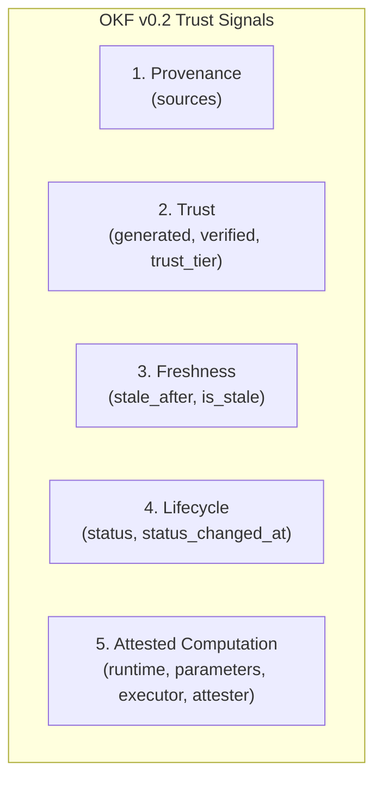
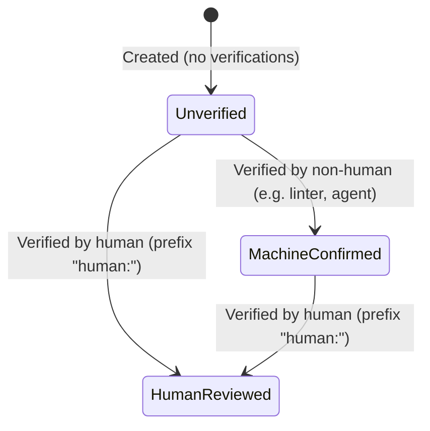
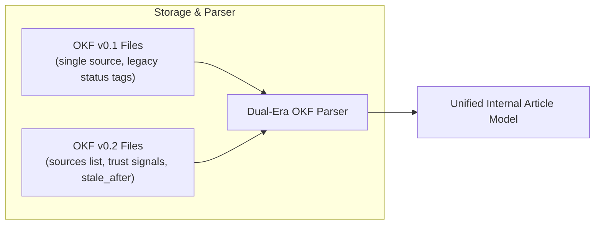

# Open Knowledge Format (OKF v0.2) User Guide 🛡️

NexWiki is built on the **Open Knowledge Format (OKF)**, an open standard for portable, human-readable, and AI-interoperable knowledge bases. In NexWiki, every wiki article, agent memory, collaborative plan, and agent skill is stored as a native OKF concept document on disk.

NexWiki supports **OKF v0.2**, introducing standardized **trust signals** that empower both human operators and AI agents to evaluate knowledge credibility, track content provenance, detect stale assumptions, verify facts, and run reproducible attested computations.

> Canonical Specification Reference: [Open Knowledge Format (OKF v0.2)](https://github.com/GoogleCloudPlatform/open-knowledge-format)

---

## 🧭 Why OKF v0.2? The 5 Core Trust Signals

As knowledge bases grow through collaboration between human operators and AI agents, knowing *what* a document says is no longer enough. You must also know *where* it came from, *who* or *what* created it, *whether* it was reviewed, *when* it expires, and *how* its computations can be verified.

OKF v0.2 defines five essential trust signals:



| Signal | Front-Matter Fields | Purpose |
|---|---|---|
| **1. Provenance** | `sources` (list of `OKFSource`), `source` | Cites authoritative origins, documentation URLs, and input materials with credibility counts and timestamps. |
| **2. Trust & Verification** | `generated` (`by`, `at`), `verified` (`by`, `at`), `trust_tier` | Records creation lineage and verification events. Automatically derives Trust Tiers (`human-reviewed`, `machine-confirmed`, `unverified`). |
| **3. Freshness** | `stale_after`, `is_stale` | Defines a temporal validity expiration date. Flags aging documentation before out-of-date instructions cause damage. |
| **4. Lifecycle** | `status`, `status_changed_at` | Tracks state in an enforced single-field lifecycle (e.g. `draft`, `implementing`, `completed`, `archived`) with dedicated change clocks. |
| **5. Attested Computation** | `runtime`, `parameters`, `computation`, `executor`, `attester` | Encapsulates reproducible algorithms and deterministic scripts with parameters and execution attestations. |

---

## 🔬 Deep Dive: Trust Tiers

Every concept document in NexWiki dynamically derives a **Trust Tier** (`trust_tier`) based on its verification history:



| Trust Tier | Badge in UI | Derivation Rule | Meaning |
|---|---|---|---|
| **Human-Reviewed** | 🟢 `Human-Reviewed` | At least one entry in `verified` where `by` has the `human:` prefix (e.g. `human:local`, `human:alice`). | A human operator reviewed and confirmed the claims against the cited sources. Highest trust level. |
| **Machine-Confirmed** | 🔵 `Machine-Confirmed` | `verified` has entries, but **none** carry a `human:` prefix (e.g. `agent:claude-3-7-sonnet`, `linter:link-checker`). | An automated process, test runner, or LLM cross-referenced sources, but no human has signed off yet. |
| **Unverified** | ⚪ `Unverified` | `verified` is empty or omitted. | Freshly drafted or unconfirmed notes. Treat claims with appropriate caution. |

### Verifying Articles in NexWiki

1. **One-Click Human Verification (Web UI)**:
   When viewing any article in the reader header, click the **Verify** button (emerald badge with checkmark). NexWiki records a verification event with `by: "human:local"` and the current timestamp, instantly promoting the article to **🟢 Human-Reviewed** and emitting an activity log event.
2. **REST API**:
   Issue a `POST /api/articles/{slug}/verify` request. The server appends a verification event and recalculates the trust tier.
3. **Machine Verification via MCP or Scripts**:
   Agents and scripts can append automated verification records (e.g. `by: "agent:code-auditor"`) during automated test passes or citation validation workflows.

---

## ⏳ Freshness & Stale Concepts

Knowledge decays. API endpoints change, configurations rotate, and dependencies update. OKF v0.2 provides the `stale_after` field (an ISO 8601 timestamp, e.g. `2026-12-31`) to state when a document's claims must be re-evaluated.

### How Freshness Works:
- When the current time exceeds `stale_after` (`now >= stale_after`), NexWiki marks the article as **`is_stale: true`**.
- **Reader Warning**: A prominent warning banner appears at the top of the article body:
  > ⚠️ **Stale Concept**: this document passed its freshness expiration date (`YYYY-MM-DD`) and may need review.
- **`wiki_health` MCP Audit**: The `wiki_health` maintenance scanner flags all expired documents under **`stale_concepts`**, reporting the expiration date and current trust tier.
- **MCP `read_article`**: When an agent reads a stale document, `read_article` prefixes a clear warning in the response text:
  `⚠️ STALE CONCEPT: this document passed its freshness expiration on YYYY-MM-DD`.

---

## 📚 Provenance: `sources` & Footnote Citations

In OKF v0.2, concepts cite their underlying materials in a structured `sources` list. Each source object can include:

| Property | Type | Description |
|---|---|---|
| `id` | string | Footnote reference identifier matching inline markdown citations (e.g. `rfc-9110` or `src-1`). |
| `resource` | string | Canonical URL, URI, or filepath where the source material is located. |
| `title` | string | Human-readable title of the cited work. |
| `author` | string | Creator, organization, or author. |
| `usage_count` | integer | Number of times or references derived from this source. |
| `last_modified`| timestamp | ISO 8601 date when the source material was last updated. |
| `usage_window`| object | `{ from, to }` framing the observation window for usage signals. |

### Footnote Citation Syntax

Inline citations in the Markdown body should reference the source `id` using standard markdown footnote syntax `[^source-id]`:

```markdown
---
type: Wiki
title: HTTP Caching Directives
slug: http-caching-directives
description: Overview of Cache-Control and validation headers.
sources:
  - id: rfc-9110
    resource: https://www.rfc-editor.org/rfc/rfc9110
    title: "RFC 9110: HTTP Semantics"
    author: IETF HTTP Working Group
    last_modified: "2022-06-01T00:00:00Z"
  - id: mdn-cache
    resource: https://developer.mozilla.org/en-US/docs/Web/HTTP/Caching
    title: HTTP Caching
    author: MDN Web Docs
---

The `Cache-Control` header defines caching constraints across intermediaries [^rfc-9110].
Browsers consult private caches prior to dispatching conditional validation requests [^mdn-cache].

[^rfc-9110]: RFC 9110 §15.4 (Field Definitions).
[^mdn-cache]: MDN Guide on HTTP caching mechanisms.
```

In the NexWiki web UI, the bottom of the article renders a dedicated **Sources** panel displaying each cited source, author, clickable link, usage count, and last-modified date.

---

## ⚙️ Attested Computations (OKF §10)

OKF v0.2 introduces a standardized document class for deterministic algorithms, scripts, or data transformations: **`Attested Computation`** (represented in front matter as `type: "Attested Computation"`).

An Attested Computation concept documents an executable process and how its results can be independently verified.

### Structure of an Attested Computation:

| Field | Type | Purpose |
|---|---|---|
| `type` | string | Must be `"Attested Computation"`. |
| `runtime` | string | Target runtime environment (e.g., `python:3.11`, `node:20`, `wasm:wasi-preview1`, `bash:5.2`). |
| `parameters` | array | Typed input parameters: `name` (string), `type` (string, e.g. `string`, `int`, `boolean`), and `required` (boolean). |
| `computation`| string | Optional pointer to external source or repository. |
| `executor` | object | Execution engine specification: `resource` (URI) and optional `receipt` (list of expected cryptographic receipt signatures or hashes). |
| `attester` | object | Attestation agent or verification code specification: `resource` (URI of attesting verifier). |

### Attested Computation Frontmatter Example:

```yaml
---
type: Attested Computation
title: Token Embedding Checksum
slug: token-embedding-checksum
description: Generates deterministic SHA-256 digests over token vocabulary vectors.
timestamp: "2026-09-01T12:00:00Z"
created_at: "2026-09-01T12:00:00Z"
runtime: python:3.11
parameters:
  - name: vocab_size
    type: integer
    required: true
  - name: normalize
    type: boolean
    required: false
executor:
  resource: docker://python:3.11-slim
  receipt:
    - sha256:4f53cda18c2baa0c0354bb5f9a3ecbe5ed12ab4d8e11ba873c2f11161202b945
attester:
  resource: https://verifier.internal.org/attest/python-runtime
generated:
  by: agent:embedding-pipeline
  at: "2026-09-01T12:00:00Z"
verified:
  - by: human:chief-architect
    at: "2026-09-02T09:30:00Z"
---
```

Followed by the computation implementation in the Markdown body:

```python
# Token Embedding Checksum Implementation

import hashlib
import json

def compute_checksum(vocab_size: int, normalize: bool = False) -> str:
    # Deterministic vocabulary vector verification
    data = f"{vocab_size}:{normalize}".encode('utf-8')
    return hashlib.sha256(data).hexdigest()
```

---

## 🔄 Dual-Era Compatibility (v0.1 & v0.2)

NexWiki is engineered with seamless **dual-era compatibility** between OKF v0.1 and OKF v0.2:



1. **Transparent File Ingestion**:
   - Files with legacy `source: "https://..."` string are fully supported. The parser synchronizes `source` with `sources[0].resource`.
   - Files with legacy status tags (e.g. `wip`, `completed`, `draft`) automatically have their status extracted into the `status` field.
   - Missing OKF v0.2 trust fields (`verified`, `generated`, `stale_after`) default safely to zero-values without error. An article without verifications is classified as `unverified`.
2. **Bundle Export**:
   - `export_okf_bundle` generates an **OKF v0.2 conformant ZIP archive**.
   - Root `index.md` explicitly declares `okf_version: "0.2"`.
   - Categorized directories: `wiki/`, `aimemories/`, `aiplans/`, `aiskills/`, and `computations/` (for Attested Computations).
   - Date-grouped activity history in `log.md`.
3. **Bundle Import**:
   - `import_okf_bundle` seamlessly accepts both OKF v0.1 and OKF v0.2 bundles.
   - Permissive conformance report (OKF §9): documents missing a `type` default to `Wiki` and are logged in `missing_type` instead of failing the import.
   - Preserves all metadata, citations, trust tiers, and lifecycle statuses across round-trips.

---

## 🤖 Using OKF v0.2 via MCP Tools

AI agents connected to NexWiki can inspect and manipulate OKF v0.2 signals through standard MCP tools:

### 1. `create_wiki_article`
Supports `sources` and `stale_after` in addition to standard fields:
```json
{
  "title": "PostgreSQL Replica Lag Diagnostics",
  "content": "Diagnosing streaming replication lag using `pg_stat_replication`...",
  "description": "Runbook for diagnosing read replica divergence.",
  "sources": [
    {
      "id": "pg-docs",
      "resource": "https://www.postgresql.org/docs/16/warm-standby.html",
      "title": "PostgreSQL 16 Warm Standby Documentation"
    }
  ],
  "stale_after": "2027-01-01"
}
```

### 2. `edit_wiki_article`
Updates or appends sources and freshness boundaries alongside optimistic locking (`loaded_version`):
```json
{
  "slug": "postgresql-replica-lag-diagnostics",
  "title": "PostgreSQL Replica Lag Diagnostics",
  "content": "Updated runbook content...",
  "loaded_version": 1,
  "stale_after": "2027-06-01"
}
```
*Note: Omit `sources` or `stale_after` to preserve existing values; pass empty array `[]` or empty string `""` to clear.*

### 3. `read_article`
Returns all trust signals in the header prose and in `structuredContent`:
```
Type: Wiki
Title: PostgreSQL Replica Lag Diagnostics
Slug: postgresql-replica-lag-diagnostics
Version: 1
Created: 2026-09-10T15:00:00Z
Updated: 2026-09-10T15:00:00Z
Description: Runbook for diagnosing read replica divergence.
Sources: [pg-docs] PostgreSQL 16 Warm Standby Documentation (https://www.postgresql.org/docs/16/warm-standby.html)
Trust Tier: ⚪ Unverified

# PostgreSQL Replica Lag Diagnostics

Runbook for diagnosing read replica divergence...
```

### 4. `wiki_health`
Detects expired knowledge base concepts:
```json
{
  "name": "wiki_health",
  "arguments": {}
}
```
Output includes:
```
- Stale concepts (past freshness expiration): 2

== Stale concepts (2) ==
- Docker Engine Setup (docker-setup) — Expired on 2026-08-01 (trust tier: machine-confirmed)
- API Gateway Routing (api-gateway) — Expired on 2026-09-01 (trust tier: human-reviewed)
```

---

## 💡 Best Practices

1. **Cite Primary Sources**: Always attach `sources` to newly synthesized articles, linking to authoritative documentation or git pull requests. Use footnote citations `[^source-id]` in the Markdown body.
2. **Set Sensible Freshness Windows**:
   - For fast-changing software setups and libraries: set `stale_after` 3–6 months out.
   - For architectural decision records (ADRs) or stable standards: set `stale_after` 12–24 months out.
3. **Verify Critical Pages**: After reviewing an AI-drafted runbook or guideline, click the **Verify** button in the UI or call the verify endpoint so downstream agents and teammates know the material is **🟢 Human-Reviewed**.
4. **Run `wiki_health` Regularly**: Schedule periodic reviews of `stale_concepts` to refresh outdated guides before errors propagate into active projects.
