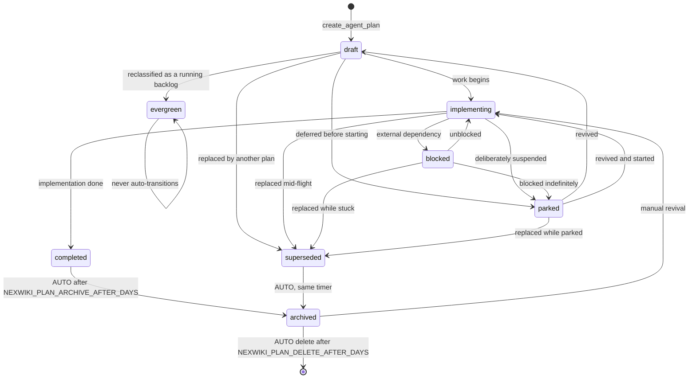

# NexWiki Plan Lifecycle Guide 🔄

Every Collaborative AI Plan (`AI-Agent-Plan`) moves through a closed, validated lifecycle of eight states, and a background worker automates the tail of it: finished plans archive themselves, and long-archived plans are eventually deleted. This guide covers the state machine, the enforcement rules, the timers, and the safety guards.

---

## The State Machine



| State | Meaning | Auto-transitions? |
|---|---|---|
| `draft` | Being written, or written and not yet started (the default for new plans) | No |
| `implementing` | Work has begun, not finished | No |
| `blocked` | Started but stuck on an external dependency | No |
| `completed` | Implementation finished | → `archived` after 90 days (default) |
| `superseded` | Terminal; the work moved to another plan | → `archived` after 90 days (default) |
| `parked` | Deliberately deferred; a design worth keeping | **Never** — the exemption is its purpose |
| `evergreen` | A running backlog with no finish line | **Never** |
| `archived` | Retired, retained for reference | → **permanently deleted** after 365 days (default) |

`parked` and `evergreen` are timer-exempt by design. A deliberately deferred product bet is not abandoned work, and a running backlog has no finish line — squeezing either into `archived` would start a deletion clock on content deliberately preserved.

---

## Enforcement

* Every plan carries **exactly one** status — zero is as invalid as two. `create_agent_plan` defaults a status-less plan to `draft`; every other write path (the web editor, `PUT /api/articles/*`, `update_article_tags`, `edit_agent_plan`, revert, import) rejects a save that would leave a plan without exactly one.
* All statuses except `archived` are **plan-exclusive**: putting `draft` or `completed` on a wiki article, memory, or skill is rejected. `archived` remains available wiki-wide with its long-standing manual semantics (see [Tags Guide](./tags.md)).
* **Values are validated strictly; transitions are log-and-allow.** A jump outside the designed state machine (say, `draft` straight to `archived`) is applied but noted to the server log — a human correcting a mis-tagged plan must always win.
* Plan statuses cannot be deleted globally (`DELETE /api/tags/{tag}` refuses them) — that would strip every plan in that state of its status.

## The Status Clock: `status_changed_at`

Each plan's front matter carries `status_changed_at`, stamped whenever its status changes. The lifecycle timers run off this clock, **never** the article's modified time — fixing a typo in a completed plan does not restart its archive countdown. The plan's header in the UI shows it ("completed since 2 months ago"), so an approaching auto-archive is visible rather than a surprise. A plan without the field (written by an external tool) is treated as *not yet eligible*, never as infinitely old.

---

## The Background Worker

The web primary runs a lifecycle worker that sweeps all plans **once at startup and then on an interval**. It never runs in `-mcp-only` mode — a sidecar must not mutate a data directory the primary owns.

### Configuration

| Variable | Default | Purpose |
|---|---|---|
| `NEXWIKI_PLAN_LIFECYCLE_INTERVAL_DAYS` | `1` | Sweep interval |
| `NEXWIKI_PLAN_ARCHIVE_AFTER_DAYS` | `90` | `completed`/`superseded` → `archived` (0 disables) |
| `NEXWIKI_PLAN_DELETE_AFTER_DAYS` | `365` | `archived` → permanently deleted (0 disables) |
| `NEXWIKI_PLAN_LIFECYCLE_DRY_RUN` | `false` | Log intended transitions without applying them |

```bash
# Conservative rollout: watch what the worker would do before letting it act
export NEXWIKI_PLAN_LIFECYCLE_DRY_RUN=true
./nexwiki -data ./wiki-data
# stderr shows: "Plan lifecycle worker (dry-run): would archive plan '…'"
```

### Safety guards on deletion

The deletion stage has no human in the loop, so it carries three guards:

1. **Dry-run mode** (above) for inspecting intended transitions.
2. **A full audit trail**: every transition is written to the durable activity log and to stderr, and broadcast over SSE so open browsers update live. A deletion logs `PERMANENTLY DELETED` with the slug.
3. **The backlink guard**: a plan that other documents still link to is **never auto-deleted**. The worker logs a refusal (visible in the activity log) and leaves it for a human decision — silently deleting a referenced document is exactly the class of unattended damage the worker must not cause.

> ⚠️ Deletion is unrecoverable without a backup. Set `NEXWIKI_PLAN_DELETE_AFTER_DAYS=0` to keep archived plans forever.

### Revival

Reviving a plan out of `archived` (swapping its status back to `draft` or `implementing`) also clears its `archived_at` stamp, so it returns to search results, listings, and the dashboard — archival is fully reversible right up until deletion.

---

## The One-Time Migration

The first boot after upgrading runs a one-time sweep (marker file: `.plan-status-migration-v1` in the data directory):

* Legacy plan statuses are remapped onto the closed vocabulary: `wip`/`in-progress`/`active` → `implementing`, `done` → `completed`, `todo`/`ready` → `draft`.
* A plan with several statuses keeps the one that is most true (terminal states win: a plan tagged both `superseded` and `completed` becomes `superseded`); a plan with none becomes `draft`.
* `status_changed_at` is backfilled to the migration date — **not** the article timestamp, which would put months-old completed plans on an immediate archive countdown. Every plan gets a fresh clock.
* Plan-exclusive statuses are stripped from non-plan documents.

Each change is logged to stderr with a per-document edit summary, and the sweep never re-runs.

---

## Working With the Lifecycle as an Agent

* `get_status_tags` returns both vocabularies grouped by document type.
* Create plans with `create_agent_plan` (starts in `draft`), move them with `edit_agent_plan` by replacing the status tag, and log progress with `append_agent_plan` (which never touches tags).
* `list_agent_plans(tag: "implementing")` filters by state; `wiki_health` reports a per-state census of the whole plan corpus and exempts `parked`/`evergreen` plans from its staleness check.
* Searching archived content: `search_wiki(tags: ["archived"])` or `include_archived: true` — an explicit `archived` tag facet implies inclusion.
