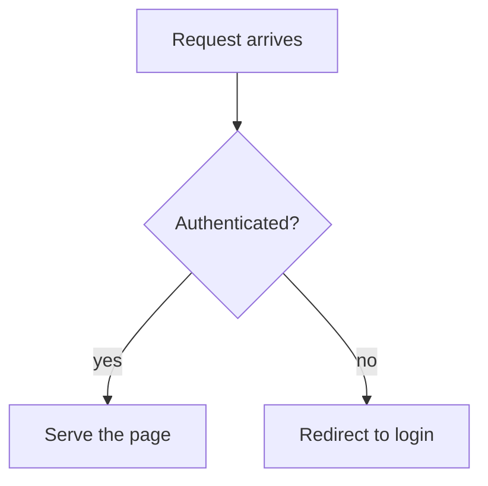

# NexWiki Reader & Dashboard Experience Guide 📖

This guide covers five reader- and dashboard-experience features: Mermaid diagram rendering, responsive reading width, the Agent Plans filter default, home dashboard state restoration, and keyboard navigation for filter autosuggestions.

---

## 1. Mermaid Diagram Rendering 📊

NexWiki renders [Mermaid](https://mermaid.js.org/) diagrams natively. Any fenced code block with the `mermaid` language renders as an SVG diagram in the article viewer, the editor's live preview, and print/PDF exports.

### Writing a diagram

Author diagrams as ordinary fenced code blocks:

````markdown

````

All Mermaid diagram types are supported — flowcharts (`graph TD` / `flowchart LR`), sequence diagrams, state diagrams (`stateDiagram-v2`), class diagrams, Gantt charts, and the rest.

### Behavior details

* **Theme-aware**: Diagrams render in Mermaid's dark theme when NexWiki is in dark mode, and re-render automatically when you toggle the theme.
* **Wide diagrams scroll**: A diagram wider than the reading column scrolls horizontally inside its own container instead of stretching the page. In print and PDF export, wide diagrams shrink to fit the page width.
* **Errors never blank the page**: A diagram with a syntax error falls back to the original code block with an inline error note, so the source is never lost.
* **Lazy loading**: The Mermaid library (~800KB) is only downloaded the first time a page containing a diagram is opened. Pages without diagrams pay nothing.
* **Live preview**: The editor's preview pane renders diagrams as you type, debounced so typing stays smooth.

---

## 2. Responsive Reading Width 📐

The article reading column now grows with your display instead of staying pinned at 672px:

| Viewport | Reading column cap |
|---|---|
| Below 1024px | 672px (`max-w-2xl`) |
| 1024px and up | 768px (`max-w-3xl`) |
| 1536px and up | 1024px (`max-w-5xl`) |

A cap is kept deliberately — unbounded line length hurts readability as much as a narrow ribbon does. The loading skeleton and search results use the same ladder, so nothing visibly reflows when content lands. The table of contents column (visible at 1280px and up) shares the row and is unaffected.

---

## 3. Agent Plans Filter Default ✅

The **Agent Plans** section on the home dashboard starts with `draft || implementing || blocked` typed into its filter box, so the default view is the work that is still open — in a long-lived wiki, the large majority of plans are finished, parked, or archived.

* The default is an ordinary filter value: it is **visible in the filter box** and removable with the standard clear (✕) button or by editing the text.
* Clearing it shows every plan, finished ones included. (Archived documents stay hidden everywhere until you type `archived` — see the [Tags Guide](./tags.md).)
* Filters match a document's lifecycle **status** alongside its title and tags, which is why these read as plain terms even though status is a field rather than a tag.
* The other dashboard sections (Wiki Index, Agent Memories, Agent Skills) have no default filter — this is a plan-lifecycle concern.

See the filter help (the `?` button beside any filter box) for the full filter syntax.

---

## 4. Home Dashboard State Restoration 🔙

Opening an article from the dashboard and pressing **Back** now returns you to the dashboard exactly as you left it:

* All five filter boxes (full-text search plus the four section filters) keep their text.
* Expanded/collapsed section states are preserved.
* The scroll position is restored.

The distinction that matters:

* **Back / Forward** (and a browser reload) restore the dashboard you left.
* **Deliberately navigating Home** — clicking the wiki name or a Home link — gives a clean dashboard with defaults.

State is kept in the browser session (per-tab `sessionStorage`); closing the tab discards it.

---

## 5. Keyboard Navigation for Filter Suggestions ⌨️

Every filter box with autosuggestions — the four dashboard sections, the sidebar filter, the activity log filter, and the editor's tag input — uses standard combobox keys:

| Key | Action |
|---|---|
| `↓` / `↑` | Move through the suggestion list (opens the dropdown if closed). The highlight wraps through the input itself at each end, so you can always get back to free typing. |
| `Enter` | Accept the highlighted suggestion |
| `Escape` | Dismiss the dropdown and clear the highlight |
| `Tab` / `Shift+Tab` | Move focus to the next/previous control, closing the dropdown |

> **Behavior change**: Suggestion navigation previously used `Tab` / `Shift+Tab`, which trapped the key every keyboard user expects to move focus. `Tab` is now an ordinary focus-movement key and does **not** accept the highlighted suggestion on the way out — `Enter` is the one commit key.

The controls carry full combobox ARIA (`role="combobox"`, `aria-activedescendant`, `role="listbox"`/`option`), so arrow-key navigation is announced to screen readers.
