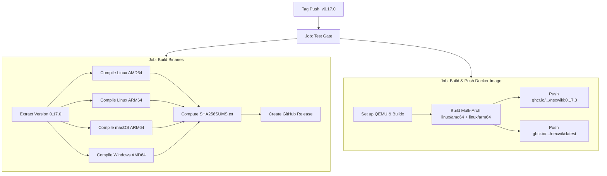

# NexWiki Release Engineering & Publishing Guide 🔖

This guide outlines the release engineering lifecycle for NexWiki. In NexWiki, **the Git tag is the release**: pushing an annotated tag matching `v*` triggers an automated GitHub Actions pipeline that validates code quality, builds multi-platform binaries, computes SHA256 checksums, publishes GitHub Releases, and pushes multi-architecture Docker container images to GitHub Container Registry (GHCR).

---

## 🔢 1. Semantic Versioning & Pre-1.0 Governance

NexWiki adheres to [Semantic Versioning 2.0.0](https://semver.org/spec/v2.0.0.html) with a standard **pre-1.0 convention**:

| Version Bump | Format | Applicability Criteria |
|---|---|---|
| **Patch** | `0.16.1` | Bug fixes, internal performance optimizations, and documentation updates. No API changes, no new user-facing features, no schema migrations. |
| **Minor** | `0.17.0` | New user-facing features, new MCP tools, or **breaking changes** (storage migrations, endpoint alterations, changed configuration defaults). Pre-1.0 allows breaking changes in minor releases, provided they are prominently documented in `CHANGELOG.md`. |
| **Major** | `1.0.0` | Reserved for the formal production-ready API stability commitment. |

---

## 🚦 2. Release Gating Checks in CI

Every release must be cut exclusively from the `main` branch. Before tagging, verify that `main` is passing all automated CI checks in [`.github/workflows/ci.yml`](../.github/workflows/ci.yml):

```bash
gh run list --branch main --limit 3
```

### The 4 Gating CI Jobs:
1. **Test**:
   * Validates clean dependency installation (`npm ci`).
   * Builds production frontend assets (`npm run build`).
   * Runs frontend component and unit tests (`npm test`).
   * Verifies standard Go code formatting (`gofmt -l`).
   * Runs Go static analysis (`go vet ./server/... .`).
   * Executes backend test suites with the race detector enabled (`go test -race -v ./server/... .`).
   * Verifies self-contained binary compilation with CGO disabled (`CGO_ENABLED=0 go build`).
2. **Container image builds**:
   * Builds the Docker image via Buildx (`mode=min` caching).
   * Runs an automated smoke test: spins up the built image in a test container, queries `/api/articles` until healthy, and parses `index.html` and embedded CSS to verify theme token rendering (`bg-themeBgPrimary`, `text-themeTextMuted`, `--color-themeBgPrimary`).
3. **Vulnerability scan**:
   * Runs `govulncheck` across all Go dependencies and backend packages.
4. **Lint (advisory)**:
   * Executes `golangci-lint` with stubbed frontend assets to identify static analysis recommendations.

---

## 🧪 3. Local Pre-Release Verification

To reproduce CI's strict validation locally before pushing release commits:

```bash
# 1. Verify code formatting (must return no output)
gofmt -l main.go server/

# 2. Run Go vet
go vet ./server/... .

# 3. Run backend tests with race detector (plain `go test` can mask concurrency issues)
go test -race ./server/... .

# 4. Run frontend tests and compilation
(cd frontend && npm ci && npm run build && npm test)

# 5. Verify static binary builds cleanly without CGO
CGO_ENABLED=0 go build -ldflags="-w -s" -o /tmp/nexwiki main.go
```

---

## 📝 4. Changelog Stamping Workflow

NexWiki maintains ongoing change logs under `## [Unreleased]` in [`CHANGELOG.md`](../CHANGELOG.md). Preparing a release involves promoting the unreleased items into a tagged version section via a dedicated pull request.

### Step 1: Branch and Edit Changelog
```bash
git checkout main
git pull
git checkout -b docs/changelog-0.17.0
```

### Step 2: Format `CHANGELOG.md`
Open `CHANGELOG.md` and promote the `[Unreleased]` block to the new version header, preserving an empty `[Unreleased]` block for future work:

```markdown
## [Unreleased]

## [0.17.0] — 2026-09-11

### Added
- Feature A description...
- Feature B description...

### Fixed
- Resolved bug X...
```

### Step 3: Verify Documentation Consistency
Check for claims that can drift across releases:
* Verify that the total MCP tool count stated across documentation (`README.md`, `AGENTS.md`, `docs/README.md`, `docs/mcp_server.md`) remains strictly accurate (**29 tools**).
* Ensure any new CLI flags or environment variables are reflected in `docs/configuration.md`.

### Step 4: PR and Merge
Commit the changelog, push the branch, open a PR, wait for CI to pass, and merge into `main`:
```bash
git commit -am "docs: stamp changelog for 0.17.0 release"
git push origin docs/changelog-0.17.0
```

---

## 🏷️ 5. Creating and Pushing the Release Tag

Once the changelog commit is merged into `main`, create an annotated Git tag prefixed with `v`:

```bash
git checkout main
git pull origin main

# Create annotated tag
git tag -a v0.17.0 -m "NexWiki 0.17.0"

# Push tag to GitHub
git push origin v0.17.0
```

> ⚠️ **Immediate Publishing Warning**: Pushing the tag immediately triggers [`.github/workflows/release.yml`](../.github/workflows/release.yml). This will create a public GitHub Release and push container images to GHCR, **including advancing the `latest` tag**. Ensure all pre-release checks have passed.

---

## ⚙️ 6. Automated Release Pipeline (`release.yml`)

When a `v*` tag is pushed, GitHub Actions executes the following pipeline:



### Artifacts Generated:
1. **GitHub Release Attachments**:
   * `nexwiki-0.17.0-linux-amd64`
   * `nexwiki-0.17.0-linux-arm64`
   * `nexwiki-0.17.0-darwin-arm64`
   * `nexwiki-0.17.0-windows-amd64.exe`
   * `SHA256SUMS.txt` (cryptographic verification file)
   * Auto-generated release notes listing merged PRs and committers
2. **Container Registry**:
   * `ghcr.io/gruberchris/nexwiki:0.17.0`
   * `ghcr.io/gruberchris/nexwiki:latest`

### Embedded Version Injection:
Every binary is compiled with linker flags:
```bash
-ldflags="-w -s -X main.Version=0.17.0"
```
This enables the server to report its running version via `GET /api/config` and in the web navigation footer.

---

## ✅ 7. Post-Release Verification

After pushing the tag, monitor and verify the release artifacts:

```bash
# 1. Watch GitHub Actions release workflow
gh run watch

# 2. Inspect the newly published GitHub Release
gh release view v0.17.0

# 3. Pull and verify the container image
docker pull ghcr.io/gruberchris/nexwiki:0.17.0

# 4. Verify version reported by running server
curl -s http://localhost:5808/api/config | jq .version
```

---

## 🔄 8. Production Rollout & Roll-Forward Best Practices

### Deploying Pinned Versions
In production environments, never point containers to `:latest`. Always pin explicit semantic release tags:
```yaml
services:
  nexwiki:
    image: ghcr.io/gruberchris/nexwiki:0.17.0
```

### Handling Storage Migrations
If a release includes a one-time data migration (documented under `### Changed` in `CHANGELOG.md`):
* Migrations execute automatically during server startup.
* Changes are written safely as new revisions to preserve document history.
* Check server startup logs on `stderr` to confirm migration progress.

### Fixing a Bad Release (Roll-Forward Rule)
If a critical defect is identified after publishing:
* **Always roll forward** with an immediate patch release (e.g., `v0.17.1`).
* **Never delete or overwrite an existing tag or release**. Deleting a tag does not revoke container images already pulled by users and results in checksum/build divergence.
